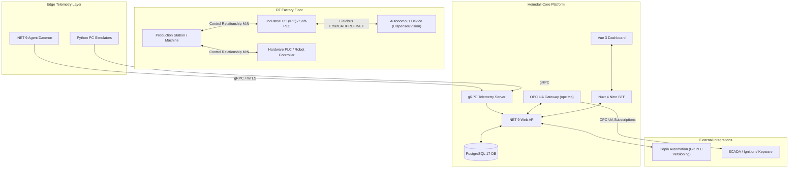

> [!NOTE]
> **Heimdall** is an industrial management system developed as a Bachelor of Science (BSc) Thesis project at the University of Pécs, Faculty of Engineering and Information Technology (PTE MIK).

# Heimdall - Industrial Management & Telemetry System

Heimdall is a multi-tenant industrial asset management, configuration tracking, and real-time monitoring platform tailored for manufacturing environments. It bridges the gap between **Information Technology (IT)** and **Operational Technology (OT)** by tracking client PCs, Industrial PCs (IPCs), Soft-PLCs (Beckhoff TwinCAT), hardware PLCs, robot controllers, specialized autonomous equipment, software assets, and spatial factory layouts.

---

## Technical Highlights

- **Backend:** .NET 9 Web API & gRPC Collector Service (.NET 9 / C# 13).
- **Data Access & Schema Strategy:** Entity Framework Core 9 with Npgsql, PostgreSQL 17 JSONB columns, GIN indexing, and dual-schema separation (`auth` for Better-Auth, `backend` for Heimdall domain).
- **Graph-Relational Domain Model:** Flexible many-to-many relationship topology linking Production Stations with one or more controlling IPCs/PLCs and equipment interconnects.
- **Frontend:** Nuxt 4 (Nuxt 4 Directory Structure), Vue 3, Tailwind CSS v4, shadcn-vue, and Vitest.
- **Client Offloading:** Server-side aggregation, filtering, and caching via Nuxt Nitro BFF (Backend-for-Frontend) routes.
- **OT Integrations:** Copia Automation Git version control integration blueprint and native OPC UA Server API (`opc.tcp://`).
- **Security & Compliance:** TISAX (VDA ISA 6.0 / High Protection) compliance framework, multi-tenant isolation, cryptographic command signing, and mTLS support.
- **Hardware Telemetry:** Deep Windows System API / WMI / SetupAPI P/Invoke driver diagnostics (e.g., Beckhoff Real-Time Ethernet NIC driver detection and TwinCAT ADS state).

---

## Repository Structure

```
heimdall/
├── agent/                   # .NET 9 Worker Service Daemon for Client PCs/IPCs
├── backend/                 # Backend API and Infrastructure layers
│   ├── App.Backend.Api/     # ASP.NET Core Web API Controllers & gRPC Endpoints
│   └── App.Infrastructure/  # Data Repositories & External Service Integrations
├── docs/                    # Technical & Architecture Documentation
├── frontend/
│   └── heimdall-web-frontend/ # Nuxt 4 Web Dashboard & Nitro BFF
├── infra/
│   └── database/            # PostgreSQL 17 Docker Compose, SSL, Init Scripts
├── seed_data/               # Inventory CSV, Incremental SQL, and Unified Pipeline
├── shared/
│   └── App.Shared/          # Domain Entities, EF Core DbContext, Protobuf Definitions
├── simulators/
│   └── edge-fleet-simulator/# Multi-device industrial edge telemetry simulator
├── tools/
│   ├── cad/                 # Synthetic DXF CAD floor plan generator
│   └── dev_manager.py       # Unified development service orchestrator & monitor
├── tests/                   # xUnit Backend tests & Vitest Frontend tests
├── run_dev.sh               # Local development environment launcher script
└── run_simulators.sh        # Multi-client Python PC simulator orchestrator script
```

---

## Domain Architecture Overview



---

## Quickstart & Local Development

### Prerequisites

Ensure you have the following installed on your machine:
- **.NET 9 SDK** (`dotnet`)
- **Node.js** (v20+) & **Bun** (`bun`)
- **Python 3** (with `venv`)
- **Docker & Docker Compose**

---

### 1. Database Infrastructure Setup

Navigate to `infra/database`:

```bash
cd infra/database
mkdir -p data logs certs secrets init
echo "postgres" > secrets/pg_user.txt
echo "supersecret" > secrets/pg_pw.txt

# Generate SSL certificates for local HTTPS Postgres
openssl req -new -x509 -days 365 -nodes -text -out certs/server.crt \
  -keyout certs/server.key -subj "/CN=localhost"

# Enforce strict file permissions required by PostgreSQL
chmod 600 certs/server.key

# Start PostgreSQL 17 container
docker compose up -d
cd ../..
```

---

### 2. Database Migrations & Local Tooling

Restore local .NET tools and run database migrations:

```bash
# Restore local EF Core CLI tool
dotnet tool restore

# Run EF Core backend migrations
dotnet ef database update --project shared/App.Shared --startup-project backend/App.Backend.Api

# Prepare Nuxt 4 frontend types
cd frontend/heimdall-web-frontend
bun run postinstall
cd ../..
```

---

### 3. Python Simulator Setup

Initialize the Python virtual environment and install simulator requirements:

```bash
# Create virtual environment
python3 -m venv venv

# Activate and install dependencies
source venv/bin/activate
pip install -r simulators/edge-fleet-simulator/requirements.txt
deactivate

# Generate synthetic DXF factory layout
venv/bin/python tools/cad/generate_plant_dxf.py
```

---

### 4. Running the Development Suite

You can start and manage all services concurrently using `run_dev.sh`:

```bash
# Start all Heimdall services
./run_dev.sh start

# Stream logs for a specific service (backend, frontend, agent, simulator, db)
./run_dev.sh logs backend

# Restart a specific service
./run_dev.sh restart frontend

# Check service health and port matrix
./run_dev.sh status

# Stop all Heimdall services
./run_dev.sh stop
```

---

### 5. Shell Auto-Completion Setup

Heimdall includes comprehensive tab-completion for `run_dev.sh`, `run_simulators.sh`, `tools/dev_manager.py`, `seed_data/seed_pipeline.py`, and `simulators/edge-fleet-simulator/fleet_simulator.py`.

```bash
# 1-Click Installation (Auto-detects Bash/Zsh and adds to ~/.bashrc or ~/.zshrc)
./tools/completions/install_completions.sh

# Or activate immediately in your current session:
source <(./run_dev.sh completion bash)   # for Bash
source <(./run_dev.sh completion zsh)    # for Zsh
```

---

## Running Verification Tests

```bash
# 1. Run .NET backend unit tests (xUnit)
dotnet test Heimdall.sln

# 2. Run Nuxt frontend unit tests (Vitest)
bun --cwd frontend/heimdall-web-frontend run test
```

---

## Security & Compliance (TISAX)

Heimdall is designed in accordance with **VDA ISA 6.0 (TISAX High Protection Needs)** guidelines:
- Multi-tenant data segregation with EF Core Global Query Filters (`OrganizationId`).
- Role-Based Access Control (RBAC) powered by Better-Auth (`auth` schema).
- Immutable system and security audit event logging (`agent_events`).
- Cryptographically signed agent command payloads (`Signature` ECDSA/RSA validation).
- Secret management via file-based secrets (`infra/database/secrets`), zero plain-text passwords in code.

---

## Documentation Sitemap

- [API Specifications](file:///home/lufis/Projects/Heimdall/heimdall/docs/API.md) - Complete REST, gRPC, and OPC UA documentation.
- [Architecture & Data Model Blueprint](file:///home/lufis/Projects/Heimdall/heimdall/docs/ARCHITECTURE.md) - Graph data model, caching, indexing, Copia, and Windows API driver telemetry.
- [Code Review & Interface Blueprint](file:///home/lufis/Projects/Heimdall/heimdall/docs/CODE_REVIEW.md) - Codebase audit, anti-pattern breakdown, required C# interfaces, and refactoring plan.
- [Confidential Data & Encryption Specification](file:///home/lufis/Projects/Heimdall/heimdall/docs/ENCRYPTION_AND_SECURITY.md) - AES-256-GCM field-level encryption for floor plans, license keys, and secrets.
- [Live Maintenance Ticketing & Android PWA](file:///home/lufis/Projects/Heimdall/heimdall/docs/MAINTENANCE_TICKETING_PWA.md) - Maintenance ticketing domain model, SignalR push, offline PWA, camera QR scanner, and Android TWA build guide.
- [Developer Guide & Handbook](file:///home/lufis/Projects/Heimdall/heimdall/docs/DEV.md) - Migration guides, simulator manual, and frontend server-side offloading.
- [TISAX Security Compliance Mapping](file:///home/lufis/Projects/Heimdall/heimdall/docs/TISAX_COMPLIANCE.md) - VDA ISA 6.0 security controls mapping.

---

## License & Commercial Licensing

Heimdall is dual-licensed:

- **Free & Open Source Community Edition:** [GNU Affero General Public License v3.0 (AGPL-3.0-or-later)](LICENSE). Free for individual engineers, researchers, and open-source contributors. In accordance with Section 13 of the AGPLv3, if you run a modified version of Heimdall across a network, the corresponding source code must be made available under the AGPLv3.
- **Commercial Enterprise License:** For industrial enterprises, manufacturing OEMs, and organizations that require deploying Heimdall on factory floor networks without AGPL-3.0 copyleft obligations, or who require closed-source proprietary extensions, dedicated support SLAs, and warranty indemnification, a Commercial Enterprise License is available. Inquire via the repository maintainer.


