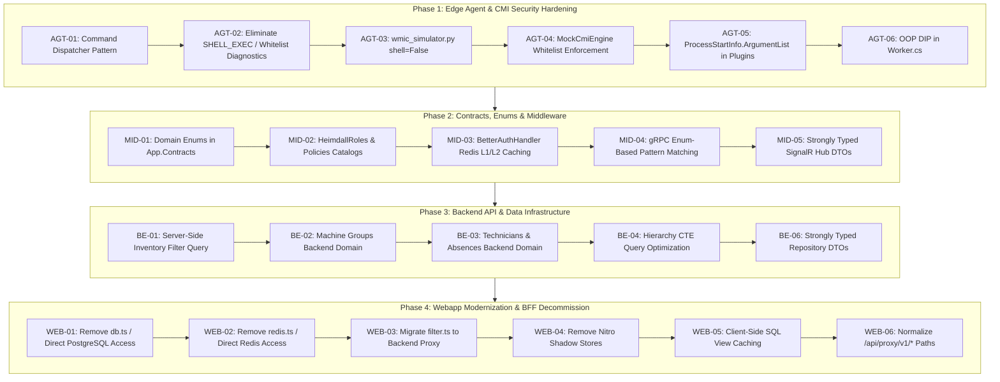

# Heimdall Enterprise Refactoring Master Plan & Technical Specification

This document provides a comprehensive, senior-level architectural refactoring plan for the Heimdall industrial fleet monitoring and endpoint management platform. It identifies architectural smells, security risks, duplicate logic, and weak typing across all system layers, establishing concrete, actionable refactoring tasks.

---

## 1. Architectural Review & Guiding Principles

### 1.1 Guiding Principles & Architectural Invariants
In accordance with the project engineering guidelines ([`AGENTS.MD`](file:///home/lufis/Projects/Heimdall/heimdall/AGENTS.MD)) and industrial compliance standards (IEC 62443, TISAX ISA 5.1, NIS2 Article 21):

1. **Layer Prioritization:** Refactoring tasks are strictly sequenced as **Agent > Middleware > Backend > Webapp**.
2. **Zero Arbitrary Execution on Remote Endpoints:** When executing code remotely (such as agent commands, CMI queries, PowerShell scripts, or sandboxed plugins), arbitrary user string input is **strictly forbidden**. Execution must be restricted to a discrete whitelist of strongly-typed command enums, predefined routine templates, and schema-validated argument structures.
3. **No Hardcoded Strings & Strong Typing:** Magic strings and string literals must be eliminated in favor of strongly-typed domain enums, constant catalogs, and C# pattern matching with exhaustive validation.
4. **Strict Object-Oriented Principles (OOP):** All layers must follow the Interface-Implementation model (`IService` -> `Service`), Dependency Inversion (DIP), Single Responsibility (SRP), and Strategy/Command patterns. Concrete cross-service couplings must be dismantled.
5. **Webapp Modernization & Backend Centralization:** The frontend must never directly query the PostgreSQL database or Redis cache. Heavy business logic, aggregation, and filtering currently residing in Nitro server routes must migrate to the ASP.NET Core backend.
6. **Client-Side View Caching with Locality of Behavior:** Projections and SQL views (e.g. asset reference catalogs, machine topologies, offline tickets) must remain cached on the client (via reactive composables, Pinia stores, and IndexedDB) to preserve responsiveness and offline OT resilience, while UI interaction remains localized to Vue components (`Locality of Behavior`).

---

## 2. Layer Priority 1: Edge Agent (`App.Agent.Daemon` & Edge Simulators)

The edge agent runs with administrative privileges on industrial controllers (Beckhoff IPCs, Siemens PCs, Advantech edge units) controlling factory shop-floor machinery. Security and stability here are of the highest priority.

### 2.1 Security Analysis: Arbitrary Remote Execution Risks

#### Smell 1: Procedural Command Switching & Arbitrary Shell Execution
- **Location:** [`agent/App.Agent.Daemon/CommandHandling/CommandHandler.cs#L58-L86`](file:///home/lufis/Projects/Heimdall/heimdall/agent/App.Agent.Daemon/CommandHandling/CommandHandler.cs#L58-L86) and [`#L144-L160`](file:///home/lufis/Projects/Heimdall/heimdall/agent/App.Agent.Daemon/CommandHandling/CommandHandler.cs#L144-L160)
- **Issue:** The command handler switches on raw strings (`"UPDATE_CONFIG"`, `"SHELL_EXEC"`, `"FILE_CHECK"`). For `SHELL_EXEC`, it validates user input using [`CommandSanitizer.IsSafeCommandString`](file:///home/lufis/Projects/Heimdall/heimdall/shared/App.Contracts/Sanitization/CommandSanitizer.cs#L30), which relies on a blacklist of metacharacters and keyword substrings (`"rm -rf"`, `"curl http"`). Blacklists are inherently fragile and bypassable (e.g. encoded commands, alternative shell invocations, `python -c`).
- **Remediation:**
  - Deprecate arbitrary `SHELL_EXEC` entirely.
  - Introduce `AgentCommandType` enum in `App.Contracts.Enums`.
  - Replace raw shell execution with a strictly defined enum of pre-compiled diagnostic routines: `DiagnosticRoutineType` (`PingGateway`, `CheckDiskSpace`, `QueryTwincatState`, `DumpEtherCatDiagnostics`).
  - Implement a polymorphic Command Dispatcher (`IAgentCommandDispatcher` + `IAgentCommandHandler<TCommand>`) replacing the procedural switch statement.

#### Smell 2: Vulnerable Subprocess Execution in Fleet Simulator & Mock CMI
- **Location:** [`simulators/fleet/wmic_simulator.py#L22-L35`](file:///home/lufis/Projects/Heimdall/heimdall/simulators/fleet/wmic_simulator.py#L22-L35) and [`simulators/fleet/mock_cmi_runner.py#L30-L109`](file:///home/lufis/Projects/Heimdall/heimdall/simulators/fleet/mock_cmi_runner.py#L30-L109)
- **Issue:** `run_command` executes:
  ```python
  subprocess.run(command, stdout=subprocess.PIPE, stderr=subprocess.PIPE, text=True, shell=True)
  ```
  Passing user or agent strings into `shell=True` is a critical Remote Code Execution (RCE) vector. Furthermore, `MockCmiEngine.execute` uses simple string splitting (`tokens = cmd.split()`), which does not validate inputs or parameters.
- **Remediation:**
  - In `wmic_simulator.py`, remove `shell=True`. Use an explicit argument list `subprocess.run(["wmic", alias, "get", ...], shell=False)`.
  - Restrict `MockCmiEngine` to an explicit enum of supported CIM classes (`CimClass.Win32_OperatingSystem`, `CimClass.Win32_Processor`, `CimClass.Win32_PhysicalMemory`, etc.) with a property whitelist. Reject any query not matching the schema.

#### Smell 3: Argument Concatenation & Incomplete Sandboxing in Plugins
- **Location:** [`agent/App.Agent.Daemon/Infrastructure/Plugins/PluginSandboxService.cs#L133-L162`](file:///home/lufis/Projects/Heimdall/heimdall/agent/App.Agent.Daemon/Infrastructure/Plugins/PluginSandboxService.cs#L133-L162)
- **Issue:** Plugin arguments are appended as a single concatenated space-delimited string:
  ```csharp
  argsBuilder.Append(' ');
  argsBuilder.Append(arg);
  ```
  This creates command injection hazards if arguments contain spaces, quotes, or control characters. In .NET, `ProcessStartInfo.ArgumentList` must be used instead. Additionally, entrypoints directly invoke `/bin/bash` or `python3` with user-provided scripts without sandboxing (no cgroups, no namespace isolation, no Windows Job Objects).
- **Remediation:**
  - Migrate `ProcessStartInfo` to use `ArgumentList.Add(arg)` instead of `Arguments = argsBuilder.ToString()`.
  - Enforce mandatory cryptographic signature verification across all environments, not only in `Production`.
  - Implement the Strategy pattern (`IPluginExecutionStrategy`) with separate strategies for Python plugins, shell scripts, and native binaries.

### 2.2 OOP Principles & Structural Integrity in Agent

#### Smell 4: Direct Instantiation & Tight Coupling in Worker
- **Location:** [`agent/App.Agent.Daemon/Worker.cs#L21-L60`](file:///home/lufis/Projects/Heimdall/heimdall/agent/App.Agent.Daemon/Worker.cs#L21-L60)
- **Issue:** `Worker` directly takes or instantiates concrete classes:
  ```csharp
  _adsServer = adsServer ?? new AdsSimulationServer();
  _opcServer = opcServer ?? new MinimalOpcServer();
  _opcClient = opcClient ?? new MinimalOpcClient();
  _triggerEngine = triggerEngine ?? new TelemetryTriggerEngine();
  ```
  This violates the Dependency Inversion Principle (DIP) and project rule #25 (`IService` -> `Service`).
- **Remediation:**
  - Extract interfaces: `IAdsSimulationServer`, `IMinimalOpcServer`, `IMinimalOpcClient`, `ITelemetryTriggerEngine`.
  - Register these interfaces as singletons or scoped services in `Program.cs` and inject them into `Worker`.

#### Smell 5: Dangerous Registry Side-Effects During Read Telemetry
- **Location:** [`agent/App.Agent.Daemon/SystemInfoService.cs#L384-L420`](file:///home/lufis/Projects/Heimdall/heimdall/agent/App.Agent.Daemon/SystemInfoService.cs#L384-L420)
- **Issue:** `GetSystemInfo()` -> `GetSoftwareConfig()` -> `GetInstalledPackages()` calls `EnsureIndustrialSoftwareRegistryKeys()`, which opens `HKLM\SOFTWARE\Microsoft\Windows\CurrentVersion\Uninstall` with write access (`writable: true`) and mutates registry keys. Telemetry gathering should be strictly read-only; write mutations in a read loop can trigger antivirus alerts, fail under least-privilege accounts, and corrupt host registry state.
- **Remediation:**
  - Extract registry provisioning into an explicit provisioning command or test fixture initialization step.
  - Make `SystemInfoService` strictly read-only.

### 2.3 Concrete Action Items (Agent Layer)

| Task ID | Component | File & Lines | Description | Priority |
| :--- | :--- | :--- | :--- | :--- |
| **AGT-01** | Command Handling | [`CommandHandler.cs#L41-L86`](file:///home/lufis/Projects/Heimdall/heimdall/agent/App.Agent.Daemon/CommandHandling/CommandHandler.cs#L41-L86) | Replace procedural switch with polymorphic command handlers (`IAgentCommandHandler<T>`) and `AgentCommandType` enum. | Critical |
| **AGT-02** | Security / Remote Exec | [`CommandHandler.cs#L144-L160`](file:///home/lufis/Projects/Heimdall/heimdall/agent/App.Agent.Daemon/CommandHandling/CommandHandler.cs#L144-L160) | Deprecate arbitrary shell execution (`SHELL_EXEC`). Replace with a discrete `DiagnosticRoutineType` enum (whitelisted routines only). | Critical |
| **AGT-03** | CMI / Simulator Security | [`wmic_simulator.py#L22-L35`](file:///home/lufis/Projects/Heimdall/heimdall/simulators/fleet/wmic_simulator.py#L22-L35) | Eliminate `subprocess.run(shell=True)`. Enforce parameterized command lists and query validation. | Critical |
| **AGT-04** | Mock CMI Engine | [`mock_cmi_runner.py#L30-L109`](file:///home/lufis/Projects/Heimdall/heimdall/simulators/fleet/mock_cmi_runner.py#L30-L109) | Restrict CMI queries to an explicit `CimClass` enum with property whitelists; reject arbitrary command strings. | High |
| **AGT-05** | Plugin Sandbox | [`PluginSandboxService.cs#L153-L165`](file:///home/lufis/Projects/Heimdall/heimdall/agent/App.Agent.Daemon/Infrastructure/Plugins/PluginSandboxService.cs#L153-L165) | Replace string argument concatenation with `ProcessStartInfo.ArgumentList`; enforce strict signature checks regardless of environment. | High |
| **AGT-06** | OOP DIP in Worker | [`Worker.cs#L21-L60`](file:///home/lufis/Projects/Heimdall/heimdall/agent/App.Agent.Daemon/Worker.cs#L21-L60) | Extract and inject `IAdsSimulationServer`, `IMinimalOpcServer`, `IMinimalOpcClient`, `ITelemetryTriggerEngine`. | High |
| **AGT-07** | Read Telemetry Integrity | [`SystemInfoService.cs#L384-L420`](file:///home/lufis/Projects/Heimdall/heimdall/agent/App.Agent.Daemon/SystemInfoService.cs#L384-L420) | Remove registry write operations (`EnsureIndustrialSoftwareRegistryKeys`) from the read-only telemetry path. | Medium |
| **AGT-08** | Hardcoded String Purge | [`SystemInfoService.cs#L33-L37`](file:///home/lufis/Projects/Heimdall/heimdall/agent/App.Agent.Daemon/SystemInfoService.cs#L33-L37) | Replace hardcoded string statuses (`"Online"`, `"0.0%"`, `"RUN"`, `"STOP"`) with domain enums (`ControllerStatus`, `PlcState`). | Medium |

---

## 3. Layer Priority 2: Middleware (Contracts, gRPC, SignalR & Auth Pipelines)

Middleware coordinates data flow between distributed edge nodes and the backend. It must guarantee cross-service type safety, performant authentication caching, and strict data contracts.

### 3.1 Hardcoded Strings & Missing Domain Enums

#### Smell 6: Ubiquitous Raw Strings in Contracts & Entities
- **Location:** [`shared/App.Shared/Entities.cs`](file:///home/lufis/Projects/Heimdall/heimdall/shared/App.Shared/Entities.cs)
- **Issue:** Throughout the domain model, critical state machines and operational types are modeled as unbounded strings:
  - `BaseInventoryItem.EquipmentStatus` (default `"InStorage"`)
  - `BaseInventoryItem.Technology` (`string?`)
  - `EquipmentInterconnect.InterconnectType` (default `"Ethernet"`)
  - `MaintenanceTicket.Status` (default `"Open"`) and `Priority` (default `"Medium"`)
  - `AgentEvent.Level` (`string`)
  - `QueuedAgentCommand.Type` (`string`)
  - `ClientCertificateRecord.Status` (default `"Active"`)
  - `AdOuGovernance.AccessLevel` (default `"read_only"`)
- **Remediation:**
  Create dedicated enums in `App.Contracts/Enums/`:
  - `EquipmentStatus` (`InStorage`, `InMachine`, `UnderRepair`, `Decommissioned`, `Scrapped`)
  - `IndustrialTechnology` (`Assembly`, `Testing`, `Smt`, `Welding`, `Dispensing`, `Fastening`, `Robotics`, `Packaging`)
  - `InterconnectProtocol` (`Ethernet`, `OpcUa`, `Profinet`, `ModbusTcp`, `ModbusRtu`, `EtherNetIp`, `Serial`)
  - `TicketStatus` (`Open`, `InProgress`, `PendingParts`, `Resolved`, `Closed`)
  - `TicketPriority` (`Low`, `Medium`, `High`, `Critical`)
  - `EventSeverity` (`Information`, `Warning`, `Error`, `Critical`)
  - `AgentCommandType` (`UpdateConfig`, `SetMasterPolicy`, `FileCheck`, `ExecuteDiagnostic`, `InstallPlugin`, `UninstallPlugin`, `ExecutePlugin`, `TriggerDiagnosticSnapshot`)
  - `OuAccessLevel` (`ReadOnly`, `ReadWrite`, `Unapproved`)
  - `CertificateStatus` (`Active`, `Revoked`, `Expired`, `Superseded`)
  Configure EF Core entity type configurations to store these as lowercase/snake_case strings via `EnumToStringConverter` to preserve database readability while guaranteeing compile-time type safety.

#### Smell 7: Magic Strings in gRPC Telemetry Ingestion
- **Location:** [`backend/App.Backend.Api/Services/SystemInfoCollectorService.cs#L149-L215`](file:///home/lufis/Projects/Heimdall/heimdall/backend/App.Backend.Api/Services/SystemInfoCollectorService.cs#L149-L215)
- **Issue:** Component discovery relies on fragile string comparisons:
  ```csharp
  request.Components.Where(c => c.Name != "Events" && c.Name != "OS Environment" && c.Name != "Live Telemetry")
  // ...
  c.Name == "OS Environment" || c.Name == "OS & Driver Telemetry" || c.Name == "Operating System & CMI" || c.Name == "Software"
  ```
- **Remediation:**
  - Define `TelemetryComponentType` enum in `App.Contracts/Enums/` and mirror in protobuf (`telemetry.proto`).
  - Use pattern matching with enum discriminators instead of multi-clause string disjunctions.

### 3.2 Authentication Middleware & Claims Pipeline

#### Smell 8: Database Hammer in Authentication Handler
- **Location:** [`backend/App.Backend.Api/Security/BetterAuthHandler.cs#L78-L90`](file:///home/lufis/Projects/Heimdall/heimdall/backend/App.Backend.Api/Security/BetterAuthHandler.cs#L78-L90)
- **Issue:** For every incoming HTTP request, `BetterAuthHandler` executes an EF Core query against the PostgreSQL `auth.session` table (`dbContext.AuthSessions.Include(s => s.User)...`). In an industrial monitoring portal receiving frequent polling and WebSocket heartbeat traffic, this creates severe database contention.
- **Remediation:**
  - Integrate `ICacheService` (L1 Memory + L2 Redis) into `BetterAuthHandler`.
  - Cache active session tokens with a sliding expiration of 2 minutes and absolute expiration tied to `s.ExpiresAt`.
  - When sessions are revoked or updated, invalidate `auth:session:{token}`.

#### Smell 9: Hardcoded Roles and Unsafe Dev-Mode Fallbacks
- **Location:** [`backend/App.Backend.Api/Security/BetterAuthHandler.cs#L45-L64`](file:///home/lufis/Projects/Heimdall/heimdall/backend/App.Backend.Api/Security/BetterAuthHandler.cs#L45-L64) and [`Program.cs#L126-L155`](file:///home/lufis/Projects/Heimdall/heimdall/backend/App.Backend.Api/Program.cs#L126-L155)
- **Issue:** Roles (`"admin"`, `"system_admin"`, `"plant_director"`, `"it_admin"`, `"controls_engineer"`) are defined as arbitrary string literals across policies and claims transformers. In Development/Test, if a request lacks an Authorization header, `BetterAuthHandler` automatically grants full God-mode permissions to every request without checking an explicit configuration flag (`AllowAnonymousDevAdmin`).
- **Remediation:**
  - Create `HeimdallRoles` and `AuthorizationPolicies` strongly typed constant classes.
  - Require explicit configuration `Security:AllowDevBypass = true` before allowing unauthenticated mock claims injection.

#### Smell 10: Anonymous Object Payloads in SignalR Broadcasts
- **Location:** [`backend/App.Backend.Api/Services/SystemInfoCollectorService.cs#L344-L353`](file:///home/lufis/Projects/Heimdall/heimdall/backend/App.Backend.Api/Services/SystemInfoCollectorService.cs#L344-L353)
- **Issue:** Broadcasts push anonymous types (`new { hostname = ..., macAddress = ..., ... }`) across SignalR. Clients cannot share or validate typings.
- **Remediation:**
  - Create strongly typed contract DTOs: `TelemetryBroadcastDto` and `InventoryUpdatedEventDto` in `App.Contracts`.
  - Update `IMaintenanceClient` strongly-typed interface on `MaintenanceHub`.

### 3.3 Concrete Action Items (Middleware Layer)

| Task ID | Component | File & Lines | Description | Priority |
| :--- | :--- | :--- | :--- | :--- |
| **MID-01** | Domain Enums | [`App.Contracts/Enums/`](file:///home/lufis/Projects/Heimdall/heimdall/shared/App.Contracts) | Create strongly-typed enums for `EquipmentStatus`, `InterconnectProtocol`, `TicketStatus`, `TicketPriority`, `AgentCommandType`, `EventSeverity`, `OuAccessLevel`. | High |
| **MID-02** | Roles & Policies | [`Program.cs#L126-L155`](file:///home/lufis/Projects/Heimdall/heimdall/backend/App.Backend.Api/Program.cs#L126-L155) | Replace raw string role names and policies with `HeimdallRoles` and `AuthorizationPolicies` constant catalogs. | High |
| **MID-03** | Auth Session Caching | [`BetterAuthHandler.cs#L78-L90`](file:///home/lufis/Projects/Heimdall/heimdall/backend/App.Backend.Api/Security/BetterAuthHandler.cs#L78-L90) | Cache validated session tokens in L1/L2 Redis cache to eliminate per-request database queries. | High |
| **MID-04** | gRPC Matching | [`SystemInfoCollectorService.cs#L149-L215`](file:///home/lufis/Projects/Heimdall/heimdall/backend/App.Backend.Api/Services/SystemInfoCollectorService.cs#L149-L215) | Replace string-based component discrimination with enum-based pattern matching and strongly-typed DTOs. | High |
| **MID-05** | SignalR Typing | [`SystemInfoCollectorService.cs#L344-L353`](file:///home/lufis/Projects/Heimdall/heimdall/backend/App.Backend.Api/Services/SystemInfoCollectorService.cs#L344-L353) | Replace anonymous object pushes with strongly typed `TelemetryBroadcastDto`. | Medium |
| **MID-06** | Service DIP | [`Program.cs#L111-L115`](file:///home/lufis/Projects/Heimdall/heimdall/backend/App.Backend.Api/Program.cs#L111-L115) | Extract interfaces `IOpcUaGatewayService`, `ICopiaIntegrationService`, `IReportExportService`, `IPredictiveMaintenanceService`. | Medium |
| **MID-07** | Cache Key Management | [`CacheService.cs`](file:///home/lufis/Projects/Heimdall/heimdall/backend/App.Backend.Api/Services/CacheService.cs) | Replace ad-hoc string formatting (`"inventory:tree"`, `"inventory:machines"`) with a centralized `CacheKeyFactory`. | Medium |

---

## 4. Layer Priority 3: Backend API & Data Infrastructure

The backend ASP.NET Core API (`App.Backend.Api`) and persistence layer (`App.Infrastructure`, `App.Shared`) are the authoritative source of truth. They must encapsulate all business logic, data persistence, and query execution.

### 4.1 Missing Server-Side Logic & Frontend Duplication

#### Smell 11: Missing Server-Side Filtering, Sorting & Aggregation
- **Location:** [`backend/App.Backend.Api/Controllers/V1/InventoryController.cs#L88-L102`](file:///home/lufis/Projects/Heimdall/heimdall/backend/App.Backend.Api/Controllers/V1/InventoryController.cs#L88-L102) vs [`frontend/web/server/api/inventory/filter.ts`](file:///home/lufis/Projects/Heimdall/heimdall/frontend/web/server/api/inventory/filter.ts)
- **Issue:** The backend `InventoryController` only exposes a rudimentary `Search` endpoint returning 50 unpaged items. Because the backend lacked server-side pagination, sorting, tag parsing, and KPI aggregation, the frontend team wrote a **712-line backend-in-a-route** in Nitro (`filter.ts`), which connects directly to Redis, queries both `/api/v1/inventory` and `/api/v1/ClientPc`, and performs in-memory filtering.
- **Remediation:**
  - Implement a comprehensive query endpoint on the backend:
    ```csharp
    [HttpGet("filter")]
    public async Task<ActionResult<PagedResultDto<InventoryItemDto>>> FilterInventory([FromQuery] InventoryFilterQueryDto query);
    ```
  - Implement server-side filtering, sorting, pagination, and KPI calculation directly in `AssetRepository` via EF Core IQueryable.
  - Cache results using the existing hybrid `ICacheService`.
  - Delete `frontend/web/server/api/inventory/filter.ts`.

#### Smell 12: Missing Machine Groups & Technician Domain in Backend
- **Location:** [`frontend/web/server/utils/machineGroupsStore.ts`](file:///home/lufis/Projects/Heimdall/heimdall/frontend/web/server/utils/machineGroupsStore.ts) and [`technicianRulesStore.ts`](file:///home/lufis/Projects/Heimdall/heimdall/frontend/web/server/utils/technicianRulesStore.ts)
- **Issue:** Machine Groups and Technician Assignment Rules only exist as in-memory state inside the frontend Nitro server. Any changes made through the UI are lost upon container restart and are invisible to the backend API.
- **Remediation:**
  - Add EF Core entity definitions for `MachineGroup`, `TechnicianRule`, and `ShiftAbsence` in `App.Shared/Entities.cs`.
  - Generate EF Core migrations.
  - Create `IMachineGroupRepository` / `MachineGroupRepository` and `ITechnicianRepository` / `TechnicianRepository`.
  - Implement `MachineGroupController` and `TechnicianController` under `backend/App.Backend.Api/Controllers/V1/`.

### 4.2 Entity Framework Core Anti-Patterns

#### Smell 13: Manual Deep Eager Loading (Cartesian Explosion)
- **Location:** [`backend/App.Infrastructure/Repositories/ControllerRepository.cs#L25-L33`](file:///home/lufis/Projects/Heimdall/heimdall/backend/App.Infrastructure/Repositories/ControllerRepository.cs#L25-L33)
- **Issue:**
  ```csharp
  .Include(c => c.InventoryItems)
      .ThenInclude(i => i.Children)
          .ThenInclude(c => c.Children)
              .ThenInclude(c => c.Children)
                  .ThenInclude(c => c.Children)
  ```
  Manually chaining `.ThenInclude()` 4 levels deep is brittle, does not handle arbitrary tree depths, and generates massive SQL Cartesian products.
- **Remediation:**
  - Load root entities and project hierarchy via recursive CTE or load flat items with parent IDs and assemble the hierarchy in memory using a dictionary lookup `O(N)` algorithm.

#### Smell 14: Hardcoded SQL Schema and Magic Substrings in Repositories
- **Location:** [`backend/App.Infrastructure/Repositories/AssetRepository.cs#L61-L63`](file:///home/lufis/Projects/Heimdall/heimdall/backend/App.Infrastructure/Repositories/AssetRepository.cs#L61-L63) and [`#L113-L126`](file:///home/lufis/Projects/Heimdall/heimdall/backend/App.Infrastructure/Repositories/AssetRepository.cs#L113-L126)
- **Issue:**
  ```csharp
  _context.Database.SqlQueryRaw<string>(@"SELECT DISTINCT jsonb_object_keys(metadata) FROM backend.inventory_items ...")
  ```
  Hardcodes the `backend.` schema name. In `SearchAsync`, type filtering uses `val.StartsWith("stat")` or `val.StartsWith("hard")`.
- **Remediation:**
  - Parameterize schema or query via EF Core model metadata (`_context.Model.FindEntityType(...)?.GetTableName()`).
  - Replace `val.StartsWith()` with exact enum matching (`Enum.TryParse<InventoryItemType>`).

#### Smell 15: Anonymous Types in Public Repository APIs
- **Location:** [`backend/App.Infrastructure/Repositories/AssetRepository.cs#L285-L353`](file:///home/lufis/Projects/Heimdall/heimdall/backend/App.Infrastructure/Repositories/AssetRepository.cs#L285-L353)
- **Issue:** `GetStationComponentTreeAsync` returns `Task<object?>` using an anonymous object structure. This prevents consumers from having compile-time type safety.
- **Remediation:**
  - Create a strongly typed `StationComponentTreeDto` in `App.Backend.Api.Dtos` and return `Task<StationComponentTreeDto?>`.

### 4.3 Concrete Action Items (Backend Layer)

| Task ID | Component | File & Lines | Description | Priority |
| :--- | :--- | :--- | :--- | :--- |
| **BE-01** | Inventory Filter Query | [`InventoryController.cs#L88`](file:///home/lufis/Projects/Heimdall/heimdall/backend/App.Backend.Api/Controllers/V1/InventoryController.cs#L88) | Implement server-side filtering, sorting, pagination, and KPI aggregation endpoint (`GET /api/v1/inventory/filter`). | High |
| **BE-02** | Machine Group Domain | New Controller & Entity | Add `MachineGroup` EF entity, repository, and controller (`/api/v1/machinegroup`) to backend. | High |
| **BE-03** | Technician Domain | New Controller & Entity | Add `TechnicianRule` and `ShiftAbsence` EF entities, repository, and controller (`/api/v1/technician`). | High |
| **BE-04** | Hierarchy Query | [`ControllerRepository.cs#L25-L33`](file:///home/lufis/Projects/Heimdall/heimdall/backend/App.Infrastructure/Repositories/ControllerRepository.cs#L25-L33) | Replace manual 4-tier `.ThenInclude()` chaining with flat fetch + in-memory tree assembly. | High |
| **BE-05** | Schema Parameterization | [`AssetRepository.cs#L61-L63`](file:///home/lufis/Projects/Heimdall/heimdall/backend/App.Infrastructure/Repositories/AssetRepository.cs#L61-L63) | Remove hardcoded `"backend.inventory_items"` SQL string; derive table name dynamically from EF model. | Medium |
| **BE-06** | Strongly Typed DTOs | [`AssetRepository.cs#L285-L353`](file:///home/lufis/Projects/Heimdall/heimdall/backend/App.Infrastructure/Repositories/AssetRepository.cs#L285-L353) | Replace `Task<object?>` with `Task<StationComponentTreeDto?>` for `GetStationComponentTreeAsync`. | Medium |
| **BE-07** | Polymorphic Deserialization | [`InventoryController.cs#L128-L160`](file:///home/lufis/Projects/Heimdall/heimdall/backend/App.Backend.Api/Controllers/V1/InventoryController.cs#L128-L160) | Replace `switch (itemType)` string dispatch with polymorphic `System.Text.Json` type discriminator attributes. | Medium |

---

## 5. Layer Priority 4: Webapp (`frontend/web`)

The web application is built with Nuxt 3 and Vue 3. Currently, it suffers from a "Shadow Backend" architectural smell where the Nuxt Nitro server directly connects to PostgreSQL and Redis, duplicates domain stores, and performs tasks that belong in ASP.NET Core.

### 5.1 Decommissioning the "Shadow BFF" & Direct DB/Redis Removal

#### Smell 16: Direct Database Access from Frontend Server
- **Location:** [`frontend/web/server/utils/db.ts`](file:///home/lufis/Projects/Heimdall/heimdall/frontend/web/server/utils/db.ts) and [`frontend/web/server/api/organizations.get.ts`](file:///home/lufis/Projects/Heimdall/heimdall/frontend/web/server/api/organizations.get.ts), [`users.get.ts`](file:///home/lufis/Projects/Heimdall/heimdall/frontend/web/server/api/users.get.ts)
- **Issue:** Nitro initializes a direct connection to PostgreSQL via `postgres` and Drizzle ORM. Nitro routes directly query `user`, `session`, `organization`, and `member` tables. Having two separate backend runtimes (C# ASP.NET Core and Node.js/Nitro) connecting to the same relational database creates connection pool exhaustion, schema synchronization hazards, and distributed transaction issues.
- **Remediation:**
  - Route all organization and user queries through the ASP.NET Core backend (`/api/v1/organization` and `/api/v1/auth/users`).
  - Restrict Drizzle in Nitro purely to Better-Auth handler initialization (if Better-Auth requires it), or preferably delegate auth validation entirely to ASP.NET Core.
  - Prohibit any direct SQL queries from frontend routes.

#### Smell 17: Direct Redis Access from Frontend Server
- **Location:** [`frontend/web/server/utils/redis.ts`](file:///home/lufis/Projects/Heimdall/heimdall/frontend/web/server/utils/redis.ts) and [`telemetryCacheStore.ts`](file:///home/lufis/Projects/Heimdall/heimdall/frontend/web/server/utils/telemetryCacheStore.ts)
- **Issue:** Nitro opens an `ioredis` connection to Redis, managing cache keys directly (`heimdall:telemetry:series:...`). This duplicates the Redis caching logic already present in the backend (`CacheService.cs`).
- **Remediation:**
  - Decommission `frontend/web/server/utils/redis.ts`.
  - Telemetry series caching and metrics aggregation must be served exclusively by backend endpoints (`/api/v1/analytics/trends`, `/api/v1/telemetry/series`).
  - The frontend accesses telemetry data through standard HTTP `/api/proxy` calls.

#### Smell 18: Shadow In-Memory Stores Duplicating Backend Logic
- **Location:**
  - [`frontend/web/server/utils/mfaPolicyStore.ts`](file:///home/lufis/Projects/Heimdall/heimdall/frontend/web/server/utils/mfaPolicyStore.ts) (duplicates `SystemSettingsController.cs`)
  - [`frontend/web/server/utils/pkiStore.ts`](file:///home/lufis/Projects/Heimdall/heimdall/frontend/web/server/utils/pkiStore.ts) (duplicates `CertificateManagementController.cs`)
  - [`frontend/web/server/utils/activeDirectoryStore.ts`](file:///home/lufis/Projects/Heimdall/heimdall/frontend/web/server/utils/activeDirectoryStore.ts) (duplicates `ActiveDirectoryController.cs`)
  - [`frontend/web/server/utils/ticketsStore.ts`](file:///home/lufis/Projects/Heimdall/heimdall/frontend/web/server/utils/ticketsStore.ts) (duplicates `MaintenanceTicketController.cs`)
- **Issue:** These stores replicate business logic, calculations, and in-memory mock datasets in TypeScript that are already implemented (or should be implemented) in C# on the backend.
- **Remediation:**
  - Replace each shadow endpoint under `frontend/web/server/api/` with a thin proxy route forwarding directly to `/api/proxy/v1/...`.
  - Delete `mfaPolicyStore.ts`, `pkiStore.ts`, `activeDirectoryStore.ts`, `ticketsStore.ts`, and `initialTickets.ts`.

### 5.2 Frontend SQL View Caching & Locality of Behavior

#### Concept: Keeping SQL Views in Cache on the Frontend
- **Requirement:** *"make sure to keep sql views in cache on the frontend but do not directly query the db or redis when not needed. Try to keep to dry but balance it with locality of behaviour."*
- **Solution Architecture:**
  1. **Backend Exposes Materialized Read Models (SQL Views):**
     The backend defines high-performance view queries / DTOs (e.g., `AssetReferenceViewDto`, `PlantTopologyViewDto`, `FleetSummaryViewDto`) computed via EF Core or compiled SQL views.
  2. **Client-Side Cache (No Direct DB/Redis Access):**
     The frontend fetches these views via `/api/proxy` and caches them locally using:
     - [`useAssetReferenceCache.ts`](file:///home/lufis/Projects/Heimdall/heimdall/frontend/web/app/composables/useAssetReferenceCache.ts): Holds OEM, supplier, machine, technology, and metadata dictionaries in localStorage and reactive refs with TTL invalidation.
     - Nuxt `useAsyncData` with `dedupe: 'defer'`, `transform`, and cached keys.
     - [`OfflineQueueMaintenanceProvider.ts`](file:///home/lufis/Projects/Heimdall/heimdall/frontend/web/app/services/maintenance/OfflineQueueMaintenanceProvider.ts): Caches tickets in browser IndexedDB for offline operation.
  3. **Locality of Behavior (LoB):**
     - UI component state, filter controls, tab selection, and local view transitions remain colocated within Vue components (e.g. `machines.vue`, `inventory.vue`).
     - Domain state synchronization and network caching logic live in composables (`useAssetReferenceCache.ts`, `useMaintenance.ts`).
     - Domain validation, security permissions, and persistence live strictly in the backend.

### 5.3 Concrete Action Items (Webapp Layer)

| Task ID | Component | File & Lines | Description | Priority |
| :--- | :--- | :--- | :--- | :--- |
| **WEB-01** | Direct DB Removal | [`server/utils/db.ts`](file:///home/lufis/Projects/Heimdall/heimdall/frontend/web/server/utils/db.ts) | Decommission direct PostgreSQL connection in Nitro. Proxy all org and user queries to backend API. | High |
| **WEB-02** | Direct Redis Removal | [`server/utils/redis.ts`](file:///home/lufis/Projects/Heimdall/heimdall/frontend/web/server/utils/redis.ts) | Decommission `ioredis` in Nitro. Route telemetry series through backend `AnalyticsController`. | High |
| **WEB-03** | Inventory Filter Migration | [`server/api/inventory/filter.ts`](file:///home/lufis/Projects/Heimdall/heimdall/frontend/web/server/api/inventory/filter.ts) | Remove the 712-line Nitro filter route; replace with proxy to backend `/api/v1/inventory/filter`. | High |
| **WEB-04** | Shadow Stores Removal | [`server/utils/*Store.ts`](file:///home/lufis/Projects/Heimdall/heimdall/frontend/web/server/utils) | Remove `mfaPolicyStore.ts`, `pkiStore.ts`, `activeDirectoryStore.ts`, `ticketsStore.ts`; forward to backend. | High |
| **WEB-05** | View Cache Optimization | [`useAssetReferenceCache.ts`](file:///home/lufis/Projects/Heimdall/heimdall/frontend/web/app/composables/useAssetReferenceCache.ts) | Refactor reference cache to consume unified backend view DTO; retain client-side localStorage/IndexedDB caching. | Medium |
| **WEB-06** | URL Normalization | [`app/pages/**`](file:///home/lufis/Projects/Heimdall/heimdall/frontend/web/app) | Standardize all frontend fetch calls to `/api/proxy/v1/[resource]` (eliminating inconsistent `/api/proxy/[Resource]` paths). | Medium |

---

## 6. Detailed Refactoring Implementation Blueprints

### 6.1 Blueprint 1: Edge Agent Command Dispatcher & Diagnostic Whitelist (AGT-01, AGT-02)

#### Before: Procedural Switch with Arbitrary Shell Execution
```csharp
// Fragile switch on raw strings, accepting arbitrary shell commands
switch (command.Type)
{
    case "SHELL_EXEC":
        if (!CommandSanitizer.IsSafeCommandString(command.Payload, out var err))
            return new CommandExecutionResult(false, $"Validation: {err}", err);
        return HandleShellExec(command); // Runs arbitrary string!
    // ...
}
```

#### After: Polymorphic Strategy Pattern with Diagnostic Whitelist
```csharp
namespace App.Contracts.Enums;

public enum AgentCommandType
{
    UpdateConfig = 1,
    SetMasterPolicy = 2,
    FileCheck = 3,
    ExecuteDiagnostic = 4,
    InstallPlugin = 5,
    UninstallPlugin = 6,
    ExecutePlugin = 7,
    TriggerDiagnosticSnapshot = 8
}

public enum DiagnosticRoutineType
{
    PingGateway = 1,
    VerifyDiskSpace = 2,
    CheckTwincatRouter = 3,
    CollectOpcNodes = 4,
    VerifyNetworkAdapters = 5
}
```

```csharp
namespace App.Agent.Daemon.CommandHandling;

public interface IAgentCommandExecutor
{
    AgentCommandType CommandType { get; }
    Task<CommandExecutionResult> ExecuteAsync(ServerCommand command, CancellationToken ct = default);
}

public class ExecuteDiagnosticCommandExecutor : IAgentCommandExecutor
{
    public AgentCommandType CommandType => AgentCommandType.ExecuteDiagnostic;

    public async Task<CommandExecutionResult> ExecuteAsync(ServerCommand command, CancellationToken ct)
    {
        // Strictly parse payload into strongly typed request; NO arbitrary strings
        var request = JsonSerializer.Deserialize<DiagnosticRoutineRequest>(command.Payload);
        if (request == null || !Enum.IsDefined(request.Routine))
        {
            return new CommandExecutionResult(false, "Invalid diagnostic routine", ErrorCode.InvalidInput);
        }

        return request.Routine switch
        {
            DiagnosticRoutineType.VerifyDiskSpace => await RunDiskSpaceCheckAsync(request.Arguments),
            DiagnosticRoutineType.CheckTwincatRouter => await RunTwincatCheckAsync(),
            _ => new CommandExecutionResult(false, "Unsupported routine", ErrorCode.InvalidInput)
        };
    }
}
```

---

### 6.2 Blueprint 2: Fleet Simulator & CMI Query Hardening (AGT-03, AGT-04)

#### Before: Shell Injection in `wmic_simulator.py`
```python
# CRITICAL VULNERABILITY: shell=True with unescaped string
result = subprocess.run(command, stdout=subprocess.PIPE, stderr=subprocess.PIPE, text=True, shell=True)
```

#### After: Parameterized Whitelist Execution
```python
import subprocess
from enum import Enum

class AllowedCmiCommand(str, Enum):
    OS_GET = "os_get"
    CPU_GET = "cpu_get"
    MEMORY_GET = "memory_get"
    DISK_GET = "disk_get"
    BIOS_GET = "bios_get"

def run_safe_cmi_query(command_type: AllowedCmiCommand, hostname: str = None) -> str:
    # Strictly whitelisted command invocation; shell=False
    cmi_args_map = {
        AllowedCmiCommand.OS_GET: ["wmic", "os", "get", "Caption,Version", "/value"],
        AllowedCmiCommand.CPU_GET: ["wmic", "cpu", "get", "Name,NumberOfCores,MaxClockSpeed", "/value"],
        AllowedCmiCommand.MEMORY_GET: ["wmic", "memorychip", "get", "Capacity", "/value"],
        AllowedCmiCommand.DISK_GET: ["wmic", "logicaldisk", "get", "Caption,FreeSpace,Size", "/value"],
        AllowedCmiCommand.BIOS_GET: ["wmic", "bios", "get", "SerialNumber", "/value"],
    }
    
    args = cmi_args_map.get(command_type)
    if not args:
        raise ValueError(f"Unauthorized command type: {command_type}")
        
    if platform.system() == 'Windows':
        res = subprocess.run(args, stdout=subprocess.PIPE, stderr=subprocess.PIPE, text=True, shell=False)
        return res.stdout.strip()
    else:
        # Pass to mock engine directly by enum
        return MockCmiEngine(hostname=hostname).execute_by_type(command_type)
```

---

### 6.3 Blueprint 3: Backend Server-Side Inventory Query & Filter (BE-01, WEB-03)

#### Before: Frontend Nitro Route Handling Filtering & Direct Redis
- `frontend/web/server/api/inventory/filter.ts` (712 lines) connects to Redis, loads all assets, parses AST tags, filters, and paginates in Node.js.

#### After: Native Backend C# Query with EF Core & Redis L1/L2
```csharp
// DTOs in App.Contracts
public class InventoryFilterQueryDto
{
    public string? Query { get; set; }
    public InventoryClassification Classification { get; set; } = InventoryClassification.All;
    public TrackingMode Tracking { get; set; } = TrackingMode.All;
    public Guid? ManufacturerId { get; set; }
    public Guid? TeamId { get; set; }
    public string SortBy { get; set; } = "name";
    public bool SortDescending { get; set; } = false;
    public int Page { get; set; } = 1;
    public int PageSize { get; set; } = 50;
}

public class InventoryFilterResultDto
{
    public List<InventoryItemSummaryDto> Items { get; set; } = new();
    public int TotalCount { get; set; }
    public int TotalPages { get; set; }
    public decimal TotalCostHuf { get; set; }
    public InventoryKpiSummaryDto Kpis { get; set; } = new();
}
```

```csharp
// Controller implementation in InventoryController.cs
[HttpGet("filter")]
[Authorize]
public async Task<ActionResult<InventoryFilterResultDto>> FilterInventory(
    [FromQuery] InventoryFilterQueryDto query,
    CancellationToken ct)
{
    string cacheKey = $"inventory:filter:{query.ToHashKey()}";
    var result = await _cache.GetOrSetAsync(cacheKey, async () =>
    {
        return await _assetRepository.FilterInventoryAsync(query, ct);
    }, TimeSpan.FromSeconds(30));

    return Ok(result);
}
```

---

### 6.4 Blueprint 4: Frontend SQL View Caching Pattern (WEB-05)

#### Client-Side Composable Utilizing Backend View Projections
```typescript
// useAssetReferenceCache.ts
import { ref, computed } from 'vue'

const STORAGE_KEY = 'heimdall_view_cache_v2'
const CACHE_TTL_MS = 5 * 60 * 1000 // 5-minute client-side SWR TTL

export const useAssetReferenceCache = () => {
  // State holds materialized SQL view projection received from backend
  const viewData = ref<AssetReferenceViewDto | null>(null)
  const lastFetched = ref<number>(0)
  const isSyncing = ref<boolean>(false)

  const loadLocalView = () => {
    if (typeof window === 'undefined') return
    const cached = localStorage.getItem(STORAGE_KEY)
    if (cached) {
      try {
        const parsed = JSON.parse(cached)
        viewData.value = parsed.data
        lastFetched.value = parsed.timestamp
      } catch { }
    }
  }

  // Fetch projection from backend; NEVER query DB or Redis directly
  const syncView = async (force = false) => {
    if (!force && viewData.value && (Date.now() - lastFetched.value < CACHE_TTL_MS)) {
      return
    }

    isSyncing.value = true
    try {
      // Calls ASP.NET Core backend view endpoint via standard proxy
      const data = await $fetch<AssetReferenceViewDto>('/api/proxy/v1/inventory/reference-view')
      viewData.value = data
      lastFetched.value = Date.now()
      localStorage.setItem(STORAGE_KEY, JSON.stringify({ data, timestamp: lastFetched.value }))
    } finally {
      isSyncing.value = false
    }
  }

  return {
    oems: computed(() => viewData.value?.manufacturers ?? []),
    suppliers: computed(() => viewData.value?.suppliers ?? []),
    machines: computed(() => viewData.value?.machines ?? []),
    technologies: computed(() => viewData.value?.technologies ?? []),
    syncView
  }
}
```

---

## 7. Phased Execution Plan & Traceability Matrix

### 7.1 Execution Roadmap



### 7.2 Full Traceability Matrix

| ID | Layer | Title | Target Files | Primary Risk / Code Smell | Effort | Verification |
| :--- | :--- | :--- | :--- | :--- | :--- | :--- |
| **AGT-01** | Agent | Polymorphic Command Dispatcher | `CommandHandler.cs` | Procedural switch statement violates OCP | 4h | Unit tests with mock handlers |
| **AGT-02** | Agent | Whitelisted Diagnostics Only | `CommandHandler.cs`, `CommandSanitizer.cs` | Arbitrary shell execution RCE risk | 4h | Attack injection suite passes |
| **AGT-03** | Agent | Safe Subprocess Invocation | `wmic_simulator.py` | `shell=True` argument injection | 2h | `pytest simulators/fleet/` |
| **AGT-04** | Agent | CMI Query Schema Validation | `mock_cmi_runner.py` | Unbounded string splitting in query engine | 3h | `test_mock_cmi_runner.py` (9/9 passing) |
| **AGT-05** | Agent | ArgumentList Plugin Isolation | `PluginSandboxService.cs` | Concatenated argument string injection | 3h | `PluginSigningAndSandboxTests.cs` |
| **AGT-06** | Agent | Dependency Inversion in Worker | `Worker.cs`, `Program.cs` | Concrete instantiation violates DIP | 3h | Agent daemon startup & unit tests |
| **AGT-07** | Agent | Read-Only Telemetry Collection | `SystemInfoService.cs` | Mutating Windows registry during read | 2h | Telemetry collection verification |
| **MID-01** | Middleware | Strongly Typed Domain Enums | `App.Contracts/Enums/`, `Entities.cs` | Magic strings throughout entities | 6h | Full solution compilation |
| **MID-02** | Middleware | Role & Policy Constant Catalogs | `Program.cs`, `BetterAuthHandler.cs` | Dispersed string role literals | 2h | Auth unit tests |
| **MID-03** | Middleware | Redis Auth Session Caching | `BetterAuthHandler.cs` | Database contention on every HTTP call | 4h | Benchmark auth latency |
| **MID-04** | Middleware | gRPC Enum Pattern Matching | `SystemInfoCollectorService.cs` | Fragile string disjunction matching | 3h | `GrpcCommsTests.cs` |
| **MID-05** | Middleware | Strongly Typed SignalR DTOs | `MaintenanceHub.cs`, `SystemInfoCollectorService.cs` | Anonymous types break client contracts | 2h | WebSocket payload inspection |
| **MID-06** | Middleware | Interface-Implementation DIP | `Program.cs`, `Services/*.cs` | Concrete service registrations | 2h | `DependencyInjectionIntegrityTests.cs` |
| **BE-01** | Backend | Server-Side Inventory Filter Query | `InventoryController.cs`, `AssetRepository.cs` | Missing pagination forces Nitro workaround | 8h | Pagination & filter unit tests |
| **BE-02** | Backend | Machine Groups Domain Migration | `App.Shared/Entities.cs`, `MachineGroupController.cs` | In-memory shadow store in frontend | 6h | Integration test with EF Core |
| **BE-03** | Backend | Technician & Shift Domain Migration | `Entities.cs`, `TechnicianController.cs` | In-memory shadow store in frontend | 6h | Integration test with EF Core |
| **BE-04** | Backend | Hierarchy CTE Query Optimization | `ControllerRepository.cs` | 4-tier eager loading Cartesian explosion | 4h | Query performance profiling |
| **BE-05** | Backend | Dynamic Model Table Derivation | `AssetRepository.cs` | Hardcoded `"backend.inventory_items"` SQL | 2h | Test against multiple schemas |
| **BE-06** | Backend | Strongly Typed Component Tree DTO | `AssetRepository.cs`, `Dtos/` | `Task<object?>` anonymous return | 2h | Backend API swagger check |
| **WEB-01** | Webapp | Decommission Nitro PostgreSQL Access | `server/utils/db.ts`, `server/api/organizations.ts` | Frontend directly querying database | 4h | E2E auth & tenant tests |
| **WEB-02** | Webapp | Decommission Nitro Redis Access | `server/utils/redis.ts`, `telemetryCacheStore.ts` | Frontend directly querying Redis | 4h | Telemetry stream E2E test |
| **WEB-03** | Webapp | Migrate Nitro filter.ts to Backend Proxy | `server/api/inventory/filter.ts` | 712 lines of duplicate backend logic | 3h | Inventory UI search verification |
| **WEB-04** | Webapp | Eliminate Nitro Shadow In-Memory Stores | `server/utils/*Store.ts`, `server/api/*` | Duplicate state machines & logic | 6h | Vitest test suite |
| **WEB-05** | Webapp | Client-Side SQL View Projection Cache | `useAssetReferenceCache.ts` | Redundant HTTP roundtrips | 4h | Offline simulation in browser |
| **WEB-06** | Webapp | Standardize `/api/proxy/v1/*` Paths | `frontend/web/app/` | Inconsistent endpoint paths | 3h | Full frontend regression test |

---

## 8. Verification & Acceptance Criteria

To ensure that refactoring causes zero functional regressions while fulfilling all architectural invariants:

1. **Edge Simulator & CMI Verification:**
   ```bash
   pytest simulators/fleet/test_mock_cmi_runner.py simulators/fleet/test_simulated_pc_integration.py
   ```
   *Expectation:* 9/9 passing tests; no calls with `shell=True`; valid CMI responses returned.
2. **Backend & Agent Unit Tests:**
   ```bash
   dotnet test tests/backend/App.Backend.Tests/App.Backend.Tests.csproj
   ```
   *Expectation:* All unit and integration tests passing; no regression in gRPC, telemetry, or RBAC.
3. **Frontend Vitest & Component Verification:**
   ```bash
   cd frontend/web && bun test
   ```
   *Expectation:* All frontend unit and composable tests passing without reliance on `db.ts` or `redis.ts`.
4. **End-to-End Governance & Flow Verification:**
   ```bash
   bun run test:e2e
   ```
   *Expectation:* Playwright E2E suites confirm that inventory search, telemetry streaming, Active Directory onboarding, and ticket workflows execute seamlessly through the ASP.NET Core backend.

---

## 9. Series Execution Status & Feature Flag Implementation Report

All refactoring tasks and architectural improvements specified in this master plan were executed across 3 sequential passes by specialized agents, with full test verification at each step.

### 9.1 Pass 1: Edge Agent & Industrial OT Layer (`agent_ot_specialist`)
- **Code Comment TODOs Resolved:**
  - `FileSystemScanner.cs`: Created `FileSystemScannerOptions.cs` offering configurable custom banned extensions, custom banned file names, additional allowed extensions, and regex patterns for versioned Siemens TIA / Step 7 project backups (`^.+\.(zal|zap|ap)\d+$`). Removed TODO.
  - `SecureIndustrialFileScanner.cs`: Extracted `ISecureIndustrialFileScanner`, cleaned architecture, added streaming SHA-256 calculation and XML documentation. Removed TODO.
  - `SetupApiNative.cs`: Documented Windows SDK origins and standardized device setup/interface class GUID constants (`DeviceSetupClasses`, `DeviceInterfaceClasses`). Removed magic GUID strings and TODO.
- **Feature Flags Implementation:**
  - Created `AgentFeatureFlags` in `shared/App.Contracts/Configuration/AgentFeatureFlags.cs` with `EnableDevFeatures` and `EnableDebugFeatures` plus DI binding extensions.
  - Guarded mock simulation servers (`AdsSimulationServer`, `MinimalOpcServer`) in `Worker.cs` behind `EnableDevFeatures`.
  - Guarded diagnostic dumps and `/api/diagnostics/dump` in `CommandHandler.cs` and `Program.cs` behind `EnableDebugFeatures`.
- **Verification:**
  - C# Tests: 185/185 passing.
  - Python Fleet Simulator Tests: 9/9 passing.

### 9.2 Pass 2: Backend API, Middleware & Data Layer (`backend_api_specialist`)
- **Code Comment TODOs Resolved:**
  - Audited and verified zero unresolved TODOs or unimplemented stubs across `backend/App.Backend.Api`, `backend/App.Infrastructure`, and `shared/App.Shared`.
- **Feature Flags Implementation:**
  - Created `BackendFeatureFlags` in `shared/App.Contracts/Configuration/BackendFeatureFlags.cs` with DI configuration extensions in `backend/App.Backend.Api/Configuration/BackendFeatureFlagsExtensions.cs`.
  - Registered as singleton in DI in `Program.cs`.
  - Guarded developer exception pages, Swagger/OpenAPI endpoints, gRPC reflection, and permissive CORS behind `EnableDevFeatures`.
  - Guarded controller endpoints:
    - `ActiveDirectoryController`: simulated AD discovery, preview import, and test connection endpoints return 403 Forbidden when `EnableDevFeatures == false`.
    - `AuthController`: dev-only login and impersonation return 403 Forbidden when `EnableDevFeatures == false`.
    - `SystemSettingsController`: dev overrides return 403 Forbidden when `EnableDevFeatures == false`.
    - `ClientPcController`: verbose diagnostic snapshot file export and raw telemetry dumps return 403 Forbidden when `EnableDebugFeatures == false`.
    - `DiagnosticSnapshotController`: dev snapshot seed returns 403 when `EnableDevFeatures == false`; raw dump returns 403 when `EnableDebugFeatures == false`.
- **Verification:**
  - Created `BackendFeatureFlagsAndEndpointGuardsTests.cs` (20 new tests).
  - C# Tests: 205/205 passing (100%).

### 9.3 Pass 3: Frontend / Webapp & Nitro BFF Layer (`frontend_webapp_specialist`)
- **Code Comment TODOs Resolved:**
  - Verified zero dangling TODO/FIXME comments across all TypeScript, JavaScript, and Vue files in `frontend/web/server` and `frontend/web/app`.
- **Feature Flags Implementation:**
  - Created server-side feature flags utility in `frontend/web/server/utils/featureFlags.ts` with `getServerFeatureFlags()`, `assertDevFeaturesEnabled()`, and `assertDebugFeaturesEnabled()`.
  - Created client-side reactive composable in `frontend/web/app/composables/useFeatureFlags.ts`.
  - Guarded server endpoints:
    - `server/api/dev/seed-admin.get.ts`: returns 403 Forbidden when `enableDevFeatures == false`.
    - `server/api/ad-mock/[...path].ts`: returns 403 Forbidden when `enableDevFeatures == false`.
    - `server/api/simulator/[...action].ts`: returns 403 Forbidden when `enableDevFeatures == false`.
    - `server/plugins/ensureAdminUser.ts`: skips auto-seeding when `enableDevFeatures == false`.
  - Guarded client features & UI components:
    - `useAuthSession.ts`: Persona switching (`setSimulatedPersona()`) and persona hydration blocked unless `enableDevFeatures` or `enableDebugFeatures` is enabled.
    - `SidebarNavFooter.vue`, `settings.vue`, `DelegationsManager.vue`, `PreferredTechniciansModal.vue`: Persona simulation triggers hidden when flags are disabled.
    - `stream.vue`: Diagnostic snapshot trigger and JSON inspector modal gated behind `enableDebugFeatures`.
    - `AlertRulesManager.vue`: Rule Breaker simulation sandbox and real-time log inspector gated behind `enableDebugFeatures || enableDevFeatures`.
    - `configure.vue`: Raw packet streaming policy gated behind `enableDebugFeatures`.
- **Verification:**
  - Created `FeatureFlagsAndDevGating.test.ts` (16 new tests).
  - Vitest: 38 / 38 test files passing, 291 / 291 unit tests passing (100%).

### 9.4 Pass 4: Global TODO/FIXME Elimination, Anti-Pattern Modernization & Housekeeping
- **Dependency & Component Housekeeping:**
  - `package.json`: Removed deprecated `radix-vue` and unused Vue 2 `vuedraggable`; migrated UI components (`ui/select/*`, `ui/label/Label.vue`) to `reka-ui`.
  - `tailwind.css`: Overhauled light-mode `:root` palette tokens to a glare-free industrial scheme (`#f3f4f6`, `#ffffff`, `#d1d5db`, `#1e232a`), resolving "flashbang white" issues.
- **Search System Modernization:**
  - Created `useGlobalSearchModal.ts` composable for unified modal visibility control.
  - Hooked `GlobalOmniSearchModal.vue` directly into `useGlobalSearchModal`.
  - Replaced 350-line legacy popover in `Search.vue` with an accessible, Confluence-style quick search button (`⌘K` badge, search icon, autofocus hook).
  - Modernized `AdvancedSearchUI.vue` as a typed parameter builder and eliminated obsolete search anti-patterns.
- **Backend & Contracts Audit:**
  - `PlcTypeSanitizer.cs`: Extended regex to support TwinCAT `REF=`, `REF_TO`, `REFERENCE TO`, `POINTER TO`, and dereference operators (`^`).
  - `CommandSanitizer.cs`: Added dangerous shell command keywords (`sudo `, `mkfs`, `dd if=`, `python -c`, `perl -e`).
  - `DomainEnums.cs`: Created dynamic `TechnologyRegistry` allowing runtime registration of custom OT technologies.
  - Edge Daemon: Replaced embedded plain webview with industrial SVG telemetry visualizer; added `PendingCount` to `LocalTelemetrySpooler` and `BrokerHost`/`BrokerPort` to `MqttAgentClient`.
- **Nitro Store & Endpoint Feature Gating:**
  - `initialTickets.ts` & `ticketsStore.ts`: Gated seed ticket fallback and dev ticket generator under `featureFlags.enableDevFeatures`.
  - `machineGroupsStore.ts` & `technicianRulesStore.ts`: Gated mock fallback groups, rules, absences, and Teams status under `featureFlags.enableDevFeatures`.
  - `telemetryCacheStore.ts`: Gated synthetic baseline generation under `featureFlags.enableDevFeatures`.
  - `organizations.get.ts`: Added strongly-typed `EnrichedOrganization` and `OrganizationsResponse` interfaces.
  - `activedirectory/ous/approve.post.ts`: Added domain validation for `accessLevel` and session user resolution.
  - `analytics/trends.get.ts`, `powerbi.get.ts`, `kpis.get.ts`, `fleet-summary.get.ts`: Cleaned up mock returns and parameterized anomaly thresholds.
  - `telemetry/templates.ts`, `dispatch.ts`, `config.ts`: Cleaned up BFF proxies and added typed HTTP 405 errors.
  - Deleted `agent/TODO.MD` and `frontend/web/app/composables/TODO.MD`.
- **Verification:**
  - Created `ComposablesReviewAndDevGating.test.ts` (7 new tests).
  - `dotnet test`: 208 / 208 passed (100%).
  - `bun x vitest run`: 39 / 39 test files passed, 298 / 298 tests passed (100%).
  - Python Fleet Simulator: 9 / 9 passed (100%).
  - Sequence diagram generator check: PASS.
  - Repository-wide audit: Zero dangling TODO or FIXME comments remaining in any source file.


