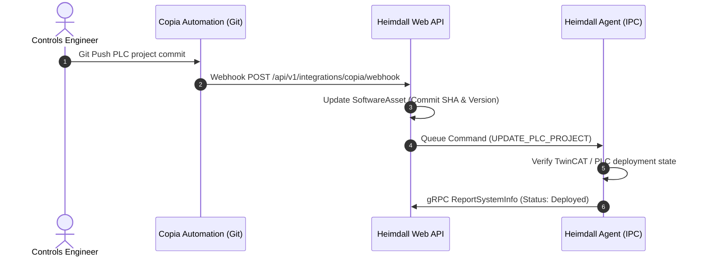
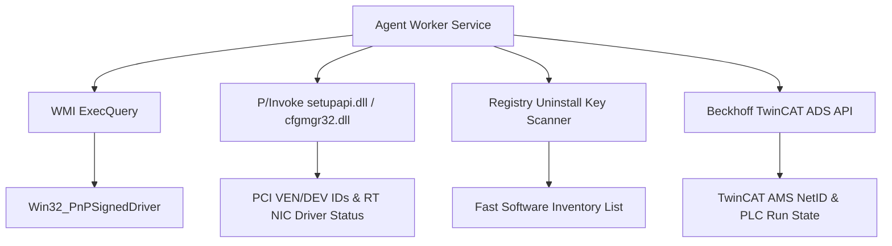
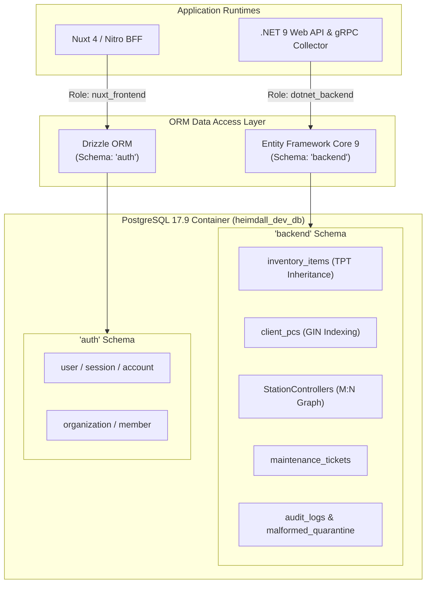
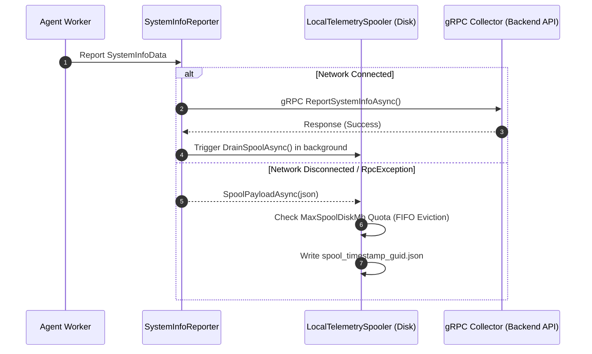

# Heimdall System Architecture & Data Model Specification

This document presents the detailed architectural design, data model graph, and integration blueprints for the **Heimdall Industrial Management System**.

---

## 1. Domain Data Model (Graph-Relational Architecture)

In industrial automation environments, production stations, controllers, hardware components, and software applications do not strictly conform to a simple parent-child tree. Heimdall implements a **graph-relational network model** that supports many-to-many (`M:N`) relationships.

### 1.1 Key Data Model Concept

```
  +--------------------+         M:N          +------------------------+
  | ProductionStation  |<-------------------->| IndustrialController   |
  | (Machine/Cell/Line)|  StationController   | (IPC / PLC / Soft-PLC) |
  +--------------------+                      +------------------------+
           |                                               |
           | 1:N                                           | 1:N
           v                                               v
  +--------------------+                      +------------------------+
  |  StationHardware   |                      |   ControllerHardware   |
  | (Junction / Asset) |                      |   (Junction / Asset)   |
  +--------------------+                      +------------------------+
           |                                               |
           +-----------------------+-----------------------+
                                   |
                                   v
                        +--------------------+
                        | HardwareComponent  |
                        | (Sensors, Drives)  |
                        +--------------------+
                                   |
                                   | 1:N
                                   v
                        +--------------------+
                        | SoftwareAsset      |
                        | (PLC/Firmware/OS)  |
                        +--------------------+
```

---

### 1.2 Entity Specifications

#### `ProductionStation` (`stations`)
Represents a physical manufacturing station, assembly line cell, or process node.
- `Id` (Guid, PK)
- `CustomIdentifier` (String, e.g., `"LINE-A-OP10"`)
- `Name` (String)
- `OrganizationId` (String, Tenant FK)
- `PinnedObjectHandle` (String, CAD DXF/SVG Handle)
- `Controllers` (Collection of `StationController` junction records)

#### `IndustrialController` (`controllers` / `client_pcs`)
Represents an Industrial PC (IPC), Hardware PLC, Soft-PLC (TwinCAT), Robot Controller, or specialized autonomous controller.
- `Id` (Guid, PK)
- `Hostname` (String)
- `MacAddress` (String)
- `IpAddress` (String)
- `ControllerType` (Enum: `IPC`, `PLC`, `SoftPLC`, `RobotController`, `Dispenser`, `VisionController`, `AutonomousDevice`)
- `LastOnline` (DateTimeOffset)
- `SystemMetadata` (JSONB: OS, IP, WMI/SetupAPI telemetry)
- `ControlledStations` (Collection of `StationController` junction records)

#### `StationController` (Junction Table)
Establishes the many-to-many relationship between `ProductionStation` and `IndustrialController`.
- `StationId` (Guid, FK)
- `ControllerId` (Guid, FK)
- `ControlRole` (Enum: `Primary`, `Secondary`, `Safety`, `Motion`, `Vision`)
- `IsPrimary` (Boolean)

#### `HardwareComponent` (`hardware_components`)
Represents physical hardware assets (CPUs, RAM sticks, NICs, Servo Drives, Dispensing Heads).
- `Id` (Guid, PK)
- `SerialNumber` (String)
- `ModelNumber` (String)
- `Revision` (String)
- `Category` (Enum: `NIC`, `CPU`, `RAM`, `Storage`, `Servo`, `FieldbusCoupler`, `DispenserHead`)
- `ManufacturerId` (Guid, FK)
- `Metadata` (JSONB)

#### `SoftwareAsset` (`software_assets`)
Represents logical software assets, PLC programs, OS installations, drivers, or firmware.
- `Id` (Guid, PK)
- `Name` (String)
- `Publisher` (String)
- `Version` (String)
- `SoftwareType` (Enum: `OS`, `Driver`, `SoftPLC_Project`, `MES_Connector`, `OPC_UA_NodeSet`, `Patch`)
- `CopiaRepoUrl` (String, optional Copia Git URL)
- `CopiaCommitSha` (String, optional Git SHA)

#### `EquipmentInterconnect` (`equipment_interconnects`)
Tracks physical fieldbus and industrial ethernet connections between controllers and station equipment.
- `Id` (Guid, PK)
- `SourceControllerId` (Guid, FK)
- `TargetControllerId` (Guid, FK)
- `Protocol` (Enum: `EtherCAT`, `PROFINET`, `OPC_UA`, `ModbusTCP`, `EtherNet_IP`)
- `ChannelInfo` (String, e.g., `"Port 1 -> EtherCAT Slave 05"`)

---

## 2. Copia Automation Integration Architecture

**Copia Automation** provides Git-based version control for PLC programs (TwinCAT, Siemens TIA Portal, Rockwell Studio 5000).



---

## 3. Windows System API Telemetry Architecture

The Heimdall Agent running on Windows Industrial PCs queries low-level hardware and driver details using a combination of WMI, P/Invoke, and Registry API calls:



---

## 4. Dual-ORM & Multi-Tenant Data Layer Architecture

Heimdall employs a specialized dual-ORM strategy designed to isolate authentication and authorization from operational manufacturing telemetry:



### 4.1 Multi-Tenancy via Global Query Filters
Multi-tenancy is enforced at the `AppDbContext` level using EF Core Global Query Filters:
```csharp
modelBuilder.Entity<ClientPc>()
    .HasQueryFilter(e => CurrentOrganizationId == null || e.OrganizationId == null || e.OrganizationId == CurrentOrganizationId);
```
All queries generated by repository classes automatically append `WHERE organization_id = @CurrentOrganizationId`, guaranteeing strict data boundaries between factory plants.

---

## 5. Edge Offline Telemetry Spooler & Quota Architecture

To ensure telemetry data is never lost during network maintenance or plant WiFi interruptions, `App.Agent.Daemon` includes an offline spooling ring buffer:




