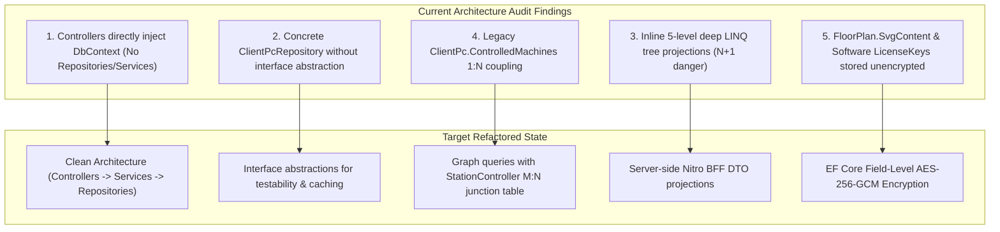
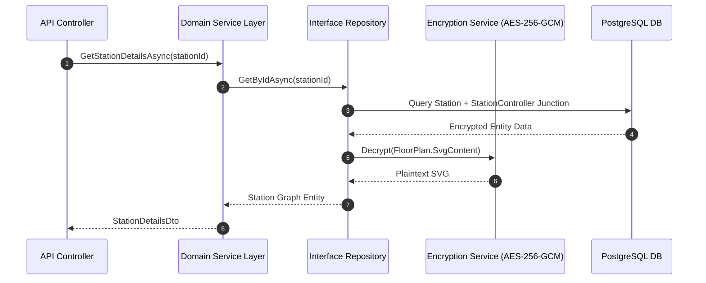

# Heimdall Code Review, Gap Analysis & Interface Blueprint

This document provides a comprehensive code review of the Heimdall codebase in its current state, highlighting anti-patterns, missing abstractions, required C# interfaces, and a refactoring blueprint to support the **Graph-Relational M:N Data Model**.

---

## 1. Code Base Audit & Gap Analysis



---

### 1.1 Detailed Review Findings

#### Finding 1: Direct `DbContext` Coupling in API Controllers
- **Files**: `MachineController.cs`, `InventoryController.cs`, `DashboardController.cs`, `OrganizationController.cs`.
- **Issue**: API controllers directly inject `AppDbContext` and execute raw EF Core queries inside HTTP action methods.
- **Impact**: Makes controllers difficult to unit test without an actual database instance, prevents swapping underlying storage providers, and prevents adding Redis/Memory caching decorators.

#### Finding 2: Lack of Repository & Service Interfaces
- **Files**: `backend/App.Infrastructure/Repositories/ClientPcRepository.cs`.
- **Issue**: `ClientPcRepository` is instantiated directly as a concrete class without implementing an `IClientPcRepository` or `IControllerRepository` interface.
- **Impact**: Violates Dependency Inversion Principle (DIP).

#### Finding 3: Inline 5-Level Deep LINQ Projections
- **Files**: `MachineController.cs` (lines 49–88).
- **Issue**: Hand-crafted 5-level nested `.Children.Select(...)` block inside the HTTP `GET /api/Machine` endpoint attempting to project recursive component trees.
- **Impact**: High computational overhead, rigid structure that breaks when components are linked in a graph topology rather than a strict tree.

#### Finding 4: Legacy Single-Parent Tree Model Coupling
- **Files**: `Entities.cs` (`ClientPc.ControlledMachines`).
- **Issue**: `ClientPc` holds a direct `List<Machine> ControlledMachines` navigation property, enforcing an assumption that a station belongs to a single controller.
- **Impact**: Incompatible with industrial manufacturing where 1 station (e.g. Robot Cell) is controlled by multiple IPCs/PLCs (Motion, Safety, Vision) and 1 IPC controls multiple stations.

---

## 2. Required Interfaces Blueprint

To achieve Clean Architecture and support the Graph-Relational Data Model, the following interface contracts are defined in `shared/App.Shared/Interfaces/`:

### 2.1 `IStationRepository.cs`
```csharp
namespace App.Shared.Interfaces;

using App.Shared.Entities;

public interface IStationRepository
{
    Task<ProductionStation?> GetByIdAsync(Guid id);
    Task<List<ProductionStation>> GetAllAsync(int page = 1, int pageSize = 25, string? search = null);
    Task<ProductionStation> CreateAsync(ProductionStation station);
    Task UpdateAsync(ProductionStation station);
    Task DeleteAsync(Guid id);
    Task AssignControllerAsync(Guid stationId, Guid controllerId, string controlRole, bool isPrimary);
    Task RemoveControllerAsync(Guid stationId, Guid controllerId);
}
```

### 2.2 `IControllerRepository.cs`
```csharp
namespace App.Shared.Interfaces;

using App.Shared.Entities;

public interface IControllerRepository
{
    Task<IndustrialController?> GetByIdAsync(Guid id);
    Task<IndustrialController?> GetByMacAddressAsync(string macAddress);
    Task<List<IndustrialController>> GetAllAsync();
    Task<IndustrialController> UpsertTelemetryAsync(IndustrialController controller);
    Task UpdateOnlineStatusAsync(Guid id, DateTimeOffset lastOnline);
}
```

### 2.3 `IAssetRepository.cs`
```csharp
namespace App.Shared.Interfaces;

using App.Shared.Entities;

public interface IAssetRepository
{
    Task<HardwareComponent?> GetHardwareByIdAsync(Guid id);
    Task<SoftwareAsset?> GetSoftwareByIdAsync(Guid id);
    Task<List<HardwareComponent>> GetHardwareByStationIdAsync(Guid stationId);
    Task<List<SoftwareAsset>> GetSoftwareByControllerIdAsync(Guid controllerId);
    Task SaveHardwareAsync(HardwareComponent hardware);
    Task SaveSoftwareAsync(SoftwareAsset software);
}
```

### 2.4 `IEncryptionService.cs`
```csharp
namespace App.Shared.Interfaces;

public interface IEncryptionService
{
    string Encrypt(string plaintext);
    string Decrypt(string ciphertext);
    byte[] EncryptBytes(byte[] plaintext);
    byte[] DecryptBytes(byte[] ciphertext);
}
```

### 2.5 `IMaintenanceTicketRepository.cs`
```csharp
namespace App.Shared.Interfaces;

using App.Shared.Entities;

public interface IMaintenanceTicketRepository
{
    Task<MaintenanceTicket?> GetByIdAsync(Guid id);
    Task<List<MaintenanceTicket>> GetTicketsAsync(Guid? stationId = null, string? status = null, int page = 1, int pageSize = 25);
    Task<MaintenanceTicket> CreateAsync(MaintenanceTicket ticket);
    Task UpdateStatusAsync(Guid ticketId, string newStatus, string technicianId);
    Task AddCommentAsync(TicketComment comment);
}
```

---

## 3. Refactoring Roadmap & Migration Plan



### Refactoring Action Items:
1. **Move Database Queries to Repositories**: Extract EF Core queries out of `MachineController`, `InventoryController`, and `DashboardController` into repository implementations.
2. **Implement `StationController` M:N Migration**: Replace legacy `ClientPc.ControlledMachines` with `StationController` junction records.
3. **Register Services in DI Container**: Register interfaces in `Program.cs` using `builder.Services.AddScoped<IStationRepository, StationRepository>()`.
4. **EF Core Encryption Converters**: Apply `EncryptedStringConverter` to `FloorPlan.SvgContent` and `SoftwareAsset.LicenseKey`.

