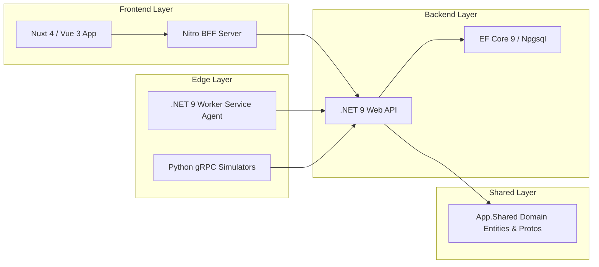

# Heimdall Developer & Architecture Guide

This document provides technical instructions for developers working on the Heimdall codebase.

---

## 1. Project Architecture & Monorepo Layout



---

## 2. Environment & Tooling Prerequisites

> [!NOTE]
> System packages (`aspnet-runtime-9.0`, `bun`, `zellij`, `ngrok`) should be installed via `paru` on Arch Linux systems. Local user tools (`dotnet-ef`) are restored via `.config/dotnet-tools.json`.

- **.NET 9 SDK** (`dotnet --version` => `9.0.x` / `10.0.x`)
- **Bun Package Manager** (`bun --version` => `1.4.x`)
- **Python 3** (`python3 --version` => `3.10+`)
- **Docker & Docker Compose** (`docker compose version`)

---

## 3. Database Schema Strategy & Migrations

Heimdall utilizes **PostgreSQL 17** with a dual-schema design:
1. `auth`: Dedicated schema managed by Better-Auth (`user`, `session`, `organization`, `member`).
2. `backend`: Dedicated schema managed by EF Core 9 (`stations`, `controllers`, `hardware_components`, `software_assets`, `agent_events`).

### Entity Framework Core Migrations

To add or modify database entities:

1. Modify entity classes in [Entities.cs](file:///home/lufis/Projects/Heimdall/heimdall/shared/App.Shared/Entities.cs).
2. Create a new migration from the repository root:
   ```bash
   dotnet ef migrations add <MigrationName> \
     --project shared/App.Shared \
     --startup-project backend/App.Backend.Api \
     --output-dir Migrations
   ```
3. Apply migrations to PostgreSQL:
   ```bash
   dotnet ef database update \
     --project shared/App.Shared \
     --startup-project backend/App.Backend.Api
   ```

---

## 4. Database Caching & Indexing Strategy

### 4.1 Indexing Architecture
To prevent database query degradation under telemetry streams, PostgreSQL GIN and B-Tree indexes are defined:

```sql
-- GIN Index on JSONB columns (system_metadata & metadata)
CREATE INDEX idx_client_pcs_system_metadata_gin 
ON backend.client_pcs USING gin (system_metadata jsonb_path_ops);

CREATE INDEX idx_hardware_metadata_gin 
ON backend.hardware_assets USING gin (metadata jsonb_path_ops);

-- B-Tree Composite Indexes for Foreign Key Navigation & Filtering
CREATE INDEX idx_agent_events_pc_timestamp 
ON backend.agent_events (client_pc_id, timestamp DESC);

CREATE INDEX idx_stations_org_custom_id 
ON backend.stations (organization_id, custom_identifier);
```

### 4.2 Caching Strategy
- **L1 In-Memory Cache (`IMemoryCache`)**: Static references (FloorPlans, Manufacturers, Suppliers) with short TTL (5 min).
- **L2 Distributed Cache (Redis)**: Live telemetry states, active sessions, and heartbeat indicators with sliding expiration (30s - 5m).
- **HTTP Conditional GET (ETag)**: Nuxt Nitro BFF headers return `304 Not Modified` when summary data has not changed.

---

## 5. Windows System API & Driver Telemetry (Beckhoff RT Driver)

The Heimdall Agent running on Industrial PCs queries driver state via Windows Management Instrumentation (WMI) and P/Invoke (`SetupAPI`):

### 5.1 Beckhoff RT Driver Detection Logic
1. **WMI Driver Query**:
   `SELECT * FROM Win32_PnPSignedDriver WHERE DeviceName LIKE '%Beckhoff%' OR Service = 'TcRTEthernet' OR Service = 'TcEth'`
2. **P/Invoke SetupAPI (`setupapi.dll` & `cfgmgr32.dll`)**:
   Enumerates `GUID_DEVCLASS_NET` device interfaces to extract hardware IDs (`PCI\VEN_8086&DEV_1539`), driver version, provider, and binding status to the Beckhoff TwinCAT Real-Time Ethernet Protocol.
3. **Registry Fast Scanner**:
   Scans `HKLM\SOFTWARE\Microsoft\Windows\CurrentVersion\Uninstall` for installed software packages without the `Win32_Product` WMI query overhead.

---

## 6. Python Simulators Handbook

Heimdall includes Python scripts to simulate telemetry and factory floor operations:

### 6.1 Script Reference
- `simulate_pcs.py`: Reads `seed_data/inventory_seed.csv` and spawns multi-threaded gRPC clients reporting telemetry to `localhost:5001`.
- `simulate_windows_wmic.py`: Simulates a Windows 10/11 IPC executing WMIC queries and reporting telemetry via gRPC.
- `generate_dxf.py`: Synthetic CAD DXF generator creating floor plan geometry matching station object handles.

### 6.2 Execution Commands

```bash
# Activate Python virtual environment
source venv/bin/activate

# Run DXF layout generator
python generate_dxf.py

# Run PC telemetry simulator
python simulate_pcs.py

# Manage simulator instances
./run_simulators.sh start
./run_simulators.sh status
./run_simulators.sh stop
```

