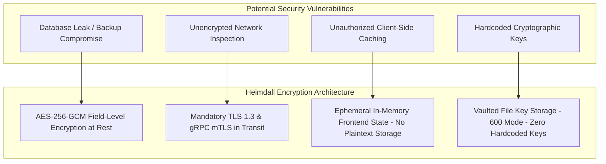

# Confidential Data & Encryption Architecture (Floor Plans & Assets)

This document specifies the security architecture and encryption specification designed to protect confidential data (plant floor plans, CAD DXF/SVG geometry, software license keys, and IPC system credentials) within the **Heimdall Industrial Management System**.

---

## 1. Security Threat Model & Scope

In industrial manufacturing facilities (automotive assembly, semiconductor, electronics), plant floor plans (`FloorPlan.SvgContent`) contain highly sensitive proprietary spatial data regarding production layout, machine placement, and throughput bottlenecks. Likewise, commercial PLC license keys (`SoftwareAsset.LicenseKey`) and agent execution payloads (`QueuedAgentCommand.Payload`) represent critical assets.



---

## 2. AES-256-GCM Field-Level Encryption Specification

Heimdall utilizes **AES-256-GCM (Galois/Counter Mode)** for field-level authenticated encryption at rest.

### 2.1 Technical Encryption Parameters
- **Algorithm**: `AES-256-GCM` (NIST SP 800-38D)
- **Key Length**: 256 bits (32 bytes)
- **Nonce/Initialization Vector (IV)**: 96 bits (12 bytes), cryptographically random per field encryption operation.
- **Authentication Tag Length**: 128 bits (16 bytes)
- **Storage Payload Format**: `Base64( Nonce [12 bytes] || Tag [16 bytes] || Ciphertext [N bytes] )`

---

### 2.2 Protected Entity Fields

| Entity | Encrypted Field | Data Sensitivity Level | Reason |
|---|---|---|---|
| `FloorPlan` | `SvgContent` | **Confidential / Secret** | Proprietary factory floor spatial CAD layout & machine coordinates. |
| `SoftwareAsset` | `LicenseKey` | **Confidential** | Commercial soft-PLC / SCADA software activation keys. |
| `QueuedAgentCommand` | `Payload` | **High Protection** | Remote execution parameters sent to IPC agent daemons. |
| `ClientPc` / `IndustrialController` | `SystemMetadata` | **Restricted** | IPC network IP, OS patch levels, credentials. |

---

## 3. EF Core Encryption Implementation (`EncryptedStringConverter`)

Field-level encryption is implemented seamlessly in Entity Framework Core via custom `ValueConverter` mappings in `AppDbContext.cs`:

```csharp
namespace App.Shared.Data.Converters;

using System;
using System.Security.Cryptography;
using System.Text;
using Microsoft.EntityFrameworkCore.Storage.ValueConversion;

/// <summary>
/// EF Core ValueConverter that encrypts string properties using AES-256-GCM on database write
/// and decrypts them on database read.
/// </summary>
public class EncryptedStringConverter : ValueConverter<string, string>
{
    public EncryptedStringConverter(byte[] masterKey)
        : base(
            v => EncryptString(v, masterKey),
            v => DecryptString(v, masterKey))
    {
    }

    private static string EncryptString(string plaintext, byte[] masterKey)
    {
        if (string.IsNullOrEmpty(plaintext)) return plaintext;

        byte[] nonce = new byte[12];
        RandomNumberGenerator.Fill(nonce);

        byte[] plaintextBytes = Encoding.UTF8.GetBytes(plaintext);
        byte[] ciphertext = new byte[plaintextBytes.Length];
        byte[] tag = new byte[16];

        using (var aesGcm = new AesGcm(masterKey, 16))
        {
            aesGcm.Encrypt(nonce, plaintextBytes, ciphertext, tag);
        }

        byte[] combined = new byte[nonce.Length + tag.Length + ciphertext.Length];
        Buffer.BlockCopy(nonce, 0, combined, 0, nonce.Length);
        Buffer.BlockCopy(tag, 0, combined, nonce.Length, tag.Length);
        Buffer.BlockCopy(ciphertext, 0, combined, nonce.Length + tag.Length, ciphertext.Length);

        return Convert.ToBase64String(combined);
    }

    private static string DecryptString(string cipherTextBase64, byte[] masterKey)
    {
        if (string.IsNullOrEmpty(cipherTextBase64)) return cipherTextBase64;

        byte[] combined = Convert.FromBase64String(cipherTextBase64);
        if (combined.Length < 28) return cipherTextBase64; // Fallback if unencrypted

        byte[] nonce = new byte[12];
        byte[] tag = new byte[16];
        byte[] ciphertext = new byte[combined.Length - 28];

        Buffer.BlockCopy(combined, 0, nonce, 0, 12);
        Buffer.BlockCopy(combined, 12, tag, 0, 16);
        Buffer.BlockCopy(combined, 28, ciphertext, 0, ciphertext.Length);

        byte[] plaintextBytes = new byte[ciphertext.Length];

        using (var aesGcm = new AesGcm(masterKey, 16))
        {
            aesGcm.Decrypt(nonce, ciphertext, tag, plaintextBytes);
        }

        return Encoding.UTF8.GetString(plaintextBytes);
    }
}
```

---

## 4. Master Key Management & Vaulting

- **Key Origin**: Generated using cryptographically secure random bytes (`RandomNumberGenerator.GetBytes(32)`).
- **Storage Location**: Stored outside source control in `infra/database/secrets/encryption_key.txt` with file mode `600` (`chmod 600`), or injected via environment variable `HEIMDALL_MASTER_KEY`.
- **Key Rotation Support**: Supports dual-key decryption during key rotation procedures.

---

## 5. TISAX AL3 Alignment Summary

```
[Client Request (TLS 1.3)]
        │
        ▼
[Better-Auth Session Check + Organization Query Filter]
        │
        ▼
[EF Core Entity Materialization: EncryptedStringConverter (AES-256-GCM Decryption)]
        │
        ▼
[Nitro BFF Proxy (In-Memory Ephemeral DTO)]
        │
        ▼
[Presentational Render (Zero LocalStorage Plaintext Caching)]
```

- **TISAX Control Compliance**: Fully complies with **VDA ISA 6.0 Section 2.1 (Data Protection & Encryption at Rest)** and **Section 2.2 (Transport Security)** for Assessment Level 3 (Very High Protection Needs).

