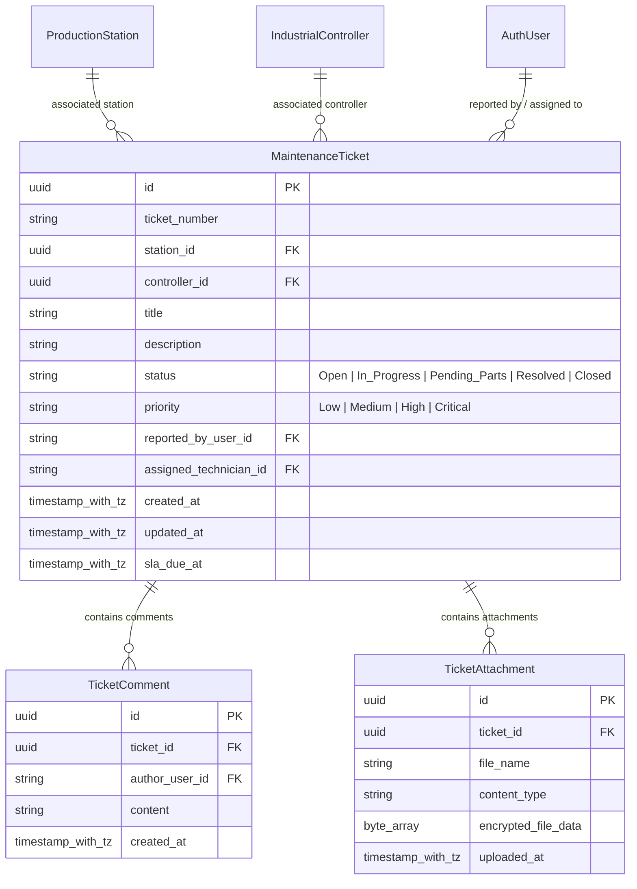
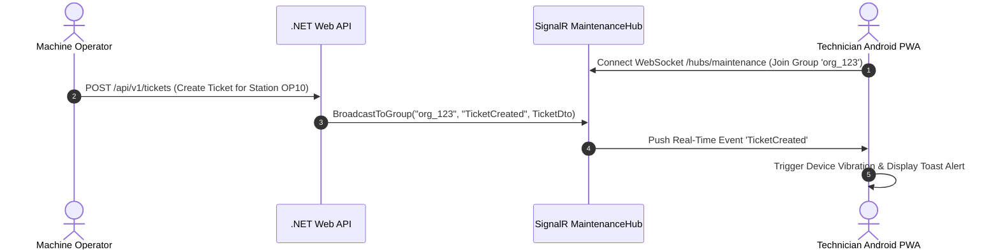

# Live Maintenance Ticketing System & Android PWA Architecture

This document specifies the technical design, real-time WebSocket protocol, offline storage strategy, camera QR scanning, and Android Progressive Web App (PWA) packaging for Heimdall's **Live Maintenance Ticketing System**.

---

## 1. Domain Model Architecture (`MaintenanceTicket`)

The ticketing module enables operators and maintenance technicians to report, track, assign, and resolve industrial equipment failures in real time.



---

## 2. Real-Time WebSocket & SignalR Push Architecture

To instantly alert floor technicians when a new ticket is created or assigned, Heimdall establishes a **SignalR Hub** (`/hubs/maintenance`).



### 2.1 SignalR Hub Interface (`IMaintenanceClient.cs`)
```csharp
namespace App.Backend.Api.Hubs;

using App.Backend.Api.Dtos;

public interface IMaintenanceClient
{
    Task TicketCreated(MaintenanceTicketDto ticket);
    Task TicketStatusUpdated(Guid ticketId, string newStatus, string technicianName);
    Task NewTicketComment(Guid ticketId, TicketCommentDto comment);
    Task CriticalAlertRaised(string stationName, string message);
}
```

---

## 3. Progressive Web App (PWA) & Offline-First Strategy

### 3.1 Web App Manifest (`public/manifest.json`)
```json
{
  "name": "Heimdall Maintenance",
  "short_name": "Heimdall",
  "description": "Real-Time Industrial Maintenance & Telemetry PWA",
  "start_url": "/",
  "display": "standalone",
  "background_color": "#0f172a",
  "theme_color": "#4f46e5",
  "icons": [
    {
      "src": "/icons/icon-192x192.png",
      "sizes": "192x192",
      "type": "image/png"
    },
    {
      "src": "/icons/icon-512x512.png",
      "sizes": "512x512",
      "type": "image/png"
    }
  ]
}
```

---

### 3.2 Service Worker Offline Caching (`public/sw.js`)
Technicians often work in factory zones with limited Wi-Fi coverage. The PWA implements an **Offline-First Strategy**:
- **Static Assets**: Cached in CacheStorage on Service Worker install.
- **API Read Requests**: Network-first with IndexedDB fallback.
- **Offline Ticket Submissions**: Enqueued in IndexedDB and synchronized automatically via **Background Sync API** (`sync` event) when network connectivity is restored.

---

### 3.3 Camera Barcode / QR Scanner Component
Technicians on the factory floor can scan QR code stickers on Industrial PCs or Stations to instantly open the corresponding maintenance ticket view.

```html
<template>
  <div class="qr-scanner-container relative">
    <video ref="videoElement" class="w-full rounded-2xl border border-slate-800" />
    <button @click="startScanner" class="btn-primary mt-3">Scan Equipment QR Code</button>
  </div>
</template>

<script setup lang="ts">
import { ref } from 'vue'

const videoElement = ref<HTMLVideoElement | null>(null)
const emit = defineEmits(['scanned'])

async function startScanner() {
  if (!navigator.mediaDevices?.getUserMedia) return

  const stream = await navigator.mediaDevices.getUserMedia({
    video: { facingMode: 'environment' }
  })

  if (videoElement.value) {
    videoElement.value.srcObject = stream
    videoElement.value.play()
  }

  // Native BarcodeDetector API (supported in Android Chrome/WebView)
  if ('BarcodeDetector' in window) {
    const detector = new (window as any).BarcodeDetector({ formats: ['qr_code', 'code_128'] })
    const interval = setInterval(async () => {
      if (!videoElement.value) return
      try {
        const barcodes = await detector.detect(videoElement.value)
        if (barcodes.length > 0) {
          clearInterval(interval)
          emit('scanned', barcodes[0].rawValue)
          stream.getTracks().forEach(track => track.stop())
        }
      } catch (e) {
        console.error(e)
      }
    }, 500)
  }
}
</script>
```

---

## 4. Android Packaging Strategy (Trusted Web Activity - TWA)

To make the PWA available as a native Android application (`.apk` / `.aab`) for corporate deployment or Android industrial handheld scanners (Zebra, Honeywell, Datalogic):

```mermaid
graph TD
    subgraph WebApp ["Nuxt 4 PWA App"]
        Manifest[manifest.json]
        AssetLinks[/.well-known/assetlinks.json]
    end

    subgraph AndroidBuild ["Bubblewrap CLI / Android Studio"]
        TWA[Trusted Web Activity Project]
        Keystore[Android Signing Keystore]
    end

    subgraph Output ["Android Output"]
        APK[Heimdall-Maintenance.apk]
        PlayStore[Google Play / Private Enterprise MDM]
    end

    Manifest --> TWA
    AssetLinks --> TWA
    Keystore --> TWA
    TWA --> APK
    APK --> PlayStore
```

### Steps to Build Android APK via Bubblewrap CLI:
1. Initialize TWA wrapper:
   ```bash
   npx @bubblewrap/cli init --manifest=https://heimdall-app.local/manifest.json
   ```
2. Build signed Android APK:
   ```bash
   npx @bubblewrap/cli build
   ```
3. Deploy via Mobile Device Management (MDM) or Google Play Private Store.

