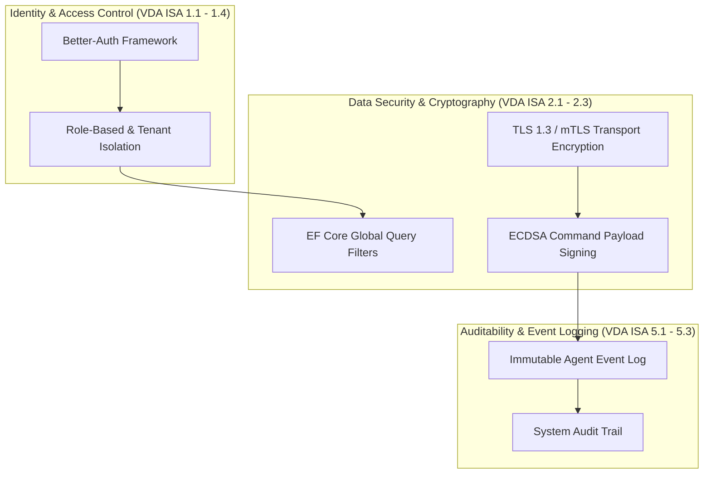

# Heimdall TISAX Compliance & Security Assessment Mapping

This document details how the **Heimdall Industrial Management System** aligns with the requirements of **TISAX (Trusted Information Security Assessment Exchange)** based on the **VDA Information Security Assessment (VDA ISA 6.0)** catalog for **High Protection Needs (Assessment Level 2 & 3)**.

---

## 1. Executive Security Overview

Manufacturing and automotive OT environments require strict information security controls to protect intellectual property, prevent unauthorized access to production lines, and ensure auditability. Heimdall embeds security controls at every architectural layer:



---

## 2. VDA ISA 6.0 Control Mapping Matrix

| VDA ISA 6.0 ID | Security Control Area | Heimdall Technical Implementation | Compliance Verification |
|---|---|---|---|
| **ISA 1.1** | **Identity & Access Management** | Authenticated session management powered by Better-Auth (`auth` schema). Enforces multi-factor authentication (MFA) and unique user identity. | `AuthSession` token validation on REST & gRPC API endpoints. |
| **ISA 1.2** | **Tenant & Data Isolation** | Multi-tenancy enforced at DbContext level using EF Core Global Query Filters (`OrganizationId`) across `BaseInventoryItem`, `ClientPc`, `MaintenanceTicket`, `AgentEvent`, and `AuditLog`. | Multi-tenant query isolation verified via unit tests (`MultiTenancyAndGovernanceTests`). |
| **ISA 1.3** | **Role-Based Access Control (RBAC)** | Fine-grained JSON privilege grants defined per user role (`UserRole.Privileges`), dynamic claims transformation (`DynamicSecurityGroupClaimsTransformer`), and Entra ID / AD group mapping. | Checked by API controller authorization policies (`[Authorize(Policy = "...")]`). |
| **ISA 2.1** | **Cryptography & Key Management** | Cryptographic verification of queued remote agent commands via RSA signatures; fail-secure command rejection on edge daemon; AES-256-GCM encryption for license keys and SVG floor plans. | `ConfigurationService.VerifySignature` and `EncryptedStringConverter` tests. |
| **ISA 2.2** | **Transport Security** | Mandatory HTTPS (TLS 1.3) for REST API; encrypted SSL connections to PostgreSQL 17; mTLS for gRPC telemetry streams; Redis password authentication (`requirepass`). | Server SSL certificates in `infra/database/certs/server.crt`. |
| **ISA 2.3** | **Secret Management & Least Privilege** | Least-privilege DML roles (`dotnet_backend`, `nuxt_frontend`) separated from DDL migrations (`ef_admin`); production environment validation for `HEIMDALL_ENCRYPTION_KEY` and `BETTER_AUTH_SECRET`. | Startup assertions in `Program.cs` and `AppDbContext.cs`. |
| **ISA 5.1** | **System Auditability & Logging** | Immutable user change logging (`AuditLog`), telemetry logging (`AgentEvent`), and dead-letter quarantine (`MalformedTelemetryRecord`) for corrupted or rejected payloads. | Centralized EF Core entities with UTC timestamps; `SystemInfoCollectorService` quarantine. |
| **ISA 5.2** | **OT & IT Network Segmentation** | Clear separation between IT management network (HTTP/JSON API) and OT fieldbus/telemetry network (mTLS gRPC / OPC UA); edge daemon offline spooler (`LocalTelemetrySpooler`) protects against network partitions. | Purdue model alignment and edge spooler unit tests. |

---

## 3. Cryptographic Command Validation Specification

To prevent unauthorized command execution on Industrial PCs (such as unauthorized configuration updates or remote service restarts), all agent commands are cryptographically signed before being queued.

```
+------------------+         Signed Payload         +-------------------+
|  Heimdall Admin  |------------------------------->|  Agent Daemon     |
|  Console / API   |  (Payload + ECDSA Signature)   |  (Industrial PC)  |
+------------------+                                +-------------------+
                                                              |
                                                              v
                                                    +-------------------+
                                                    | Verify Signature  |
                                                    | against Public    |
                                                    | Key Certificate   |
                                                    +-------------------+
                                                              |
                                                     [Valid]  |  [Invalid]
                                                        +-----+-----+
                                                        |           |
                                                        v           v
                                                     Execute     Reject &
                                                     Command      Audit Log
```

1. **Signing**: When an administrator queues an agent command via `POST /api/v1/controllers/{id}/commands`, the backend signs the JSON payload string using the system private key.
2. **Transmission**: The signature is stored in `QueuedAgentCommand.Signature` and delivered to the Agent via gRPC (`GetPendingCommands`).
3. **Verification**: The Agent daemon validates the signature against the trusted Heimdall Server Public Key before executing the payload. If signature verification fails, the command is rejected, and a `Critical` security event is logged in `AgentEvent`.

---

## 4. Audit Trail & Log Retention Policy

- **Event Storage**: Security events are recorded in `backend.agent_events` with fields `Source`, `Message`, `Level`, `ClientPcId`, and `Timestamp`.
- **Severity Levels**:
  - `Information`: Routine telemetry, normal heartbeat status.
  - `Warning`: Resource usage limit exceeded, disk space low.
  - `Error`: Command processing failure, driver binding mismatch.
  - `Critical`: Cryptographic signature failure, unauthorized access attempt, unexpected agent disconnect.
- **Retention**: Log records are retained for a minimum of 12 months to satisfy TISAX audit requirements.

