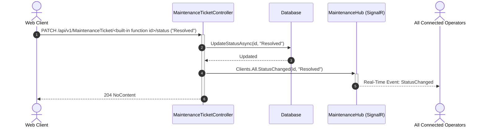

# Heimdall API & Interface Reference

This document provides the reference manual for all interfaces exposed by Heimdall:
1. **REST Web API** (`HTTP/JSON`)
2. **gRPC Telemetry Ingestion Service** (`HTTP/2 Protobuf`)
3. **SignalR WebSocket Maintenance Hub** (`/hubs/maintenance`)
4. **Data Transfer Objects (DTOs)**
5. **OPC UA Server & Gateway Interface** (`opc.tcp://`)

---

## 1. REST Web API (`/api/v1/`)

The REST Web API is hosted on port `5099` (HTTP) and `5001` (HTTPS) behind the Nuxt Nitro BFF reverse proxy (`/api/proxy/*`).

### 1.1 Authentication & Tenant Context
All non-public endpoints require session authentication and tenant identification headers:
* `Authorization: Bearer <session_token>`
* `X-Organization-Id: <organization_uuid>`

When making calls through the frontend Nitro proxy, these headers are injected automatically from the verified user session cookie.

---

### 1.2 Production Stations (`/api/v1/stations`)

#### `GET /api/v1/stations`
Retrieves a paginated list of manufacturing stations in the active tenant organization.
* **Query Parameters**:
  * `page` (`int`, default: `1`): Page index.
  * `pageSize` (`int`, default: `25`): Maximum records per page.
  * `search` (`string`, optional): Filters by station name or custom identifier.
* **Response `200 OK`**:
```json
{
  "items": [
    {
      "id": "c39a82e4-180b-48c4-912f-2d6e3bf8e801",
      "name": "Line 01 - Body Assembly Alpha - Station 10",
      "customIdentifier": "LINE-01-OP10",
      "pinnedObjectHandle": "5A1F",
      "primaryControllerId": "e14b99f2-2b63-4c91-923a-59b43d2c1102",
      "primaryControllerHostname": "ROBOT-CELL-01",
      "isOnline": true,
      "alertCount": 0
    }
  ],
  "totalCount": 1,
  "page": 1,
  "pageSize": 25
}
```

#### `GET /api/v1/stations/{id}`
Retrieves detailed metadata, controller associations, and equipment interconnects for a specific station.
* **Response `200 OK`**:
```json
{
  "id": "c39a82e4-180b-48c4-912f-2d6e3bf8e801",
  "name": "Line 01 - Body Assembly Alpha - Station 10",
  "customIdentifier": "LINE-01-OP10",
  "pinnedObjectHandle": "5A1F",
  "organizationId": "Production Floor A",
  "controllers": [
    {
      "clientPcId": "e14b99f2-2b63-4c91-923a-59b43d2c1102",
      "hostname": "ROBOT-CELL-01",
      "ipAddress": "192.168.1.101",
      "controlRole": "Primary",
      "isPrimary": true,
      "lastOnline": "2026-09-03T18:50:00Z"
    }
  ],
  "interconnects": [
    {
      "id": "7b2e3f4a-5c6d-7e8f-9a0b-1c2d3e4f5a6b",
      "targetControllerHostname": "DISPENSER-CELL-01",
      "protocol": "EtherCAT",
      "channelInfo": "Port 1 -> Slave 04 (EK1100)"
    }
  ]
}
```

---

### 1.3 Industrial Controllers (`/api/v1/controllers`)

#### `GET /api/v1/controllers`
Lists all registered edge industrial PCs, Soft-PLCs, and devices.
* **Response `200 OK`**:
```json
[
  {
    "id": "e14b99f2-2b63-4c91-923a-59b43d2c1102",
    "hostname": "ROBOT-CELL-01",
    "macAddress": "02:42:AC:12:00:03",
    "ipAddress": "192.168.1.101",
    "lastOnline": "2026-09-03T18:58:45Z",
    "isOnline": true,
    "cpuUsagePercent": 14.2,
    "ramUsagePercent": 48.6,
    "freeDiskSpaceGb": { "C:": 124.5, "D:": 450.0 },
    "controlledStations": [
      {
        "stationId": "c39a82e4-180b-48c4-912f-2d6e3bf8e801",
        "customIdentifier": "LINE-01-OP10",
        "isPrimary": true
      }
    ]
  }
]
```

#### `POST /api/v1/controllers/{id}/commands`
Queues a signed operational command for an edge agent daemon.
* **Request Body**:
```json
{
  "type": "UPDATE_CONFIG",
  "payload": "{\"heartbeatIntervalSeconds\": 30}",
  "signature": "MEUCIQD...=="
}
```
* **Response `202 Accepted`**:
```json
{
  "commandId": "a1b2c3d4-e5f6-7a8b-9c0d-1e2f3a4b5c6d",
  "status": "Queued",
  "createdAt": "2026-09-03T18:58:50Z"
}
```

#### `POST /api/v1/ClientPc/{id}/snapshot`
Triggers an immediate, immutable diagnostic snapshot capture for an edge IPC controller. Dispatches a signed `TRIGGER_DIAGNOSTIC_SNAPSHOT` command, seals the captured JSON payload with a SHA-256 cryptographic digest, and logs a non-repudiable audit event.
* **Response `200 OK`**:
```json
{
  "id": "7b1c3d4e-5f6a-7b8c-9d0e-1f2a3b4c5d6e",
  "clientPcId": "e14b99f2-2b63-4c91-923a-59b43d2c1102",
  "hostname": "IPC-L01-01",
  "machineIdentifier": "LINE-01-OP10",
  "capturedByUserId": "usr-admin-01",
  "capturedByUserName": "Admin User",
  "capturedAtUtc": "2026-09-13T22:30:00Z",
  "payloadHashSha256": "e3b0c44298fc1c149afbf4c8996fb92427ae41e4649b934ca495991b7852b855",
  "payloadSizeBytes": 14258,
  "snapshotPayloadJson": "{ ... }"
}
```

#### `GET /api/v1/ClientPc/{id}/snapshots`
Retrieves historical diagnostic snapshots for an IPC node, ordered newest first.
* **Response `200 OK`**: Returns array of `DiagnosticSnapshotSummaryDto`.

---

### 1.4 Maintenance Tickets (`/api/v1/tickets`)

#### `GET /api/v1/tickets`
Returns incident tickets filtered by status, priority, or station.
* **Query Parameters**:
  * `status` (`string`, optional): `Open`, `In_Progress`, `Pending_Parts`, `Resolved`, `Closed`.
  * `priority` (`string`, optional): `Low`, `Medium`, `High`, `Critical`.
  * `stationId` (`uuid`, optional): Filter by associated station.

#### `POST /api/v1/tickets`
Creates a new maintenance incident. Triggers real-time SignalR broadcasts.
* **Request Body**:
```json
{
  "title": "Axis X Servo Motor Thermal Warning",
  "description": "Temperature probe reads 87C during high-speed cycle. Bearing inspection required.",
  "priority": "High",
  "stationId": "c39a82e4-180b-48c4-912f-2d6e3bf8e801",
  "clientPcId": "e14b99f2-2b63-4c91-923a-59b43d2c1102"
}
```
* **Response `201 Created`**: Returns the complete `MaintenanceTicketDto`.

#### `PATCH /api/v1/tickets/{id}`
Updates status, priority, or technician assignment.
* **Request Body**:
```json
{
  "status": "In_Progress",
  "assignedTo": "user_2ab48a53"
}
```

#### `POST /api/v1/tickets/{id}/comments`
Appends a technician note or resolution observation.
* **Request Body**:
```json
{
  "content": "Lubrication replenished. Thermographic camera shows temperature drop to 54C."
}
```

---

### 1.5 Asset Inventory (`/api/v1/inventory`)

#### `GET /api/v1/inventory`
Retrieves equipment components supporting search, filtering, and pagination.
* **Query Parameters**:
  * `tree` (`boolean`, default: `false`): If true, returns assets structured in parent-child hierarchy.
  * `type` (`string`, optional): `HardwareComponent`, `SoftwareAsset`, `Machine`.
* **Response `200 OK`**: Array of `InventoryItemDto`.

#### `GET /api/v1/inventory/parts`
Retrieves discrete serialized high-value capital assets (`isStockItem == false`). Each part is either installed on a machine (`InMachine`), stored in warehouse inventory (`InStorage`), or in repair depot (`UnderRepair`).
* **Query Parameters**:
  * `status` (`string`, optional): Filter by `InMachine`, `InStorage`, `UnderRepair`.
  * `technology` (`string`, optional): Filter by `Assembly`, `Test`, `SMT`, `Welding`, `Fastening`, `Dispensing`, `Robotics`.
  * `machineId` (`uuid`, optional): Filter parts installed on a specific station.
* **Response `200 OK`**:
```json
[
  {
    "id": "comp-101",
    "name": "Spindle Motor Assembly 15kW",
    "displayName": "Main CNC Spindle Motor",
    "serialNumber": "SN-SPINDLE-994",
    "isStockItem": false,
    "equipmentStatus": "InMachine",
    "storageLocation": "OP10 Main Spindle Mount",
    "technology": "Assembly",
    "machineId": "024ca7de-eb1c-5af6-aad8-826caca2d75e",
    "machine": {
      "id": "024ca7de-eb1c-5af6-aad8-826caca2d75e",
      "customIdentifier": "L01-OP10",
      "displayName": "Line 01 - Body Assembly Alpha - Station 10"
    }
  }
]
```

#### `GET /api/v1/inventory/stock`
Retrieves bulk consumable and quantity-tracked stock items (`isStockItem == true`).
* **Query Parameters**:
  * `technology` (`string`, optional): Technology domain filter.
  * `lowStockOnly` (`boolean`, default: `false`): If true, returns only items where `stockQuantity <= minStockThreshold`.
* **Response `200 OK`**:
```json
[
  {
    "id": "stock-101",
    "name": "STK-SCRW-M8",
    "displayName": "M8x25mm Assembly Bolts",
    "serialNumber": "LOT-2026-B01",
    "isStockItem": true,
    "stockQuantity": 9,
    "minStockThreshold": 3,
    "storageLocation": "Bin 42-B",
    "technology": "Fastening"
  }
]
```

#### `GET /api/v1/inventory/station-tree/{id}`
Returns the hierarchical component tree for a designated production station on demand, eliminating the need for full-table recursive queries.
* **Route Parameters**:
  * `id` (`uuid`): Unique identifier of the station.
* **Response `200 OK`**:
```json
{
  "stationId": "024ca7de-eb1c-5af6-aad8-826caca2d75e",
  "customIdentifier": "L01-OP10",
  "displayName": "Line 01 - Body Assembly Alpha - Station 10",
  "installedComponents": [
    {
      "id": "comp-101",
      "name": "Spindle Motor Assembly 15kW",
      "serialNumber": "SN-SPINDLE-994",
      "equipmentStatus": "InMachine",
      "storageLocation": "OP10 Main Spindle Mount",
      "technology": "Assembly",
      "subComponents": []
    }
  ],
  "controllers": [
    {
      "id": "cpc-001",
      "hostname": "CPC-001",
      "controlRole": "Primary"
    }
  ]
}
```

#### `POST /api/v1/inventory`
Creates a new physical or logical equipment component.
* **Request Body**:
```json
{
  "name": "SRV-AX5106",
  "displayName": "Beckhoff AX5106 Single-Axis Servo Drive",
  "itemType": "HardwareComponent",
  "manufacturerId": "3a603620-1bbb-5f06-a92b-ce675965c311",
  "serialNumber": "SN-SRV-90142",
  "costInHUF": 450000.00,
  "storageLocation": "OP20 Axis Drive",
  "equipmentStatus": "InMachine",
  "isStockItem": false,
  "technology": "Welding",
  "metadata": {
    "RatedCurrent": "6.0A",
    "SupplyVoltage": "400V AC",
    "SafetyFunction": "STO"
  }
}
```

---

### 1.6 Production Machines & Lines (`/api/v1/machine`)

#### `GET /api/v1/machine/by-technology`
Retrieves machines and production stations grouped by engineering technology discipline: `Assembly`, `Test`, `SMT`, `Welding`, `Fastening`, `Dispensing`, and `Robotics`.
* **Response `200 OK`**:
```json
[
  {
    "technology": "Assembly",
    "stationCount": 133,
    "stations": [
      {
        "id": "024ca7de-eb1c-5af6-aad8-826caca2d75e",
        "name": "L01-OP10",
        "displayName": "Line 01 - Body Assembly Alpha - Station 10",
        "customIdentifier": "L01-OP10",
        "machineType": "Fitting",
        "groupId": "Line 01 - Body Assembly Alpha"
      }
    ]
  }
]
```

#### `GET /api/v1/machine/by-line`
Retrieves production lines with nested stations, controller associations, and health status indicators.
* **Response `200 OK`**:
```json
[
  {
    "line": "Line 01 - Body Assembly Alpha",
    "stationCount": 34,
    "stations": [
      {
        "id": "024ca7de-eb1c-5af6-aad8-826caca2d75e",
        "customIdentifier": "L01-OP10",
        "machineType": "Fitting",
        "technology": "Assembly",
        "isOnline": true
      }
    ]
  }
]
```

---

### 1.7 Active Directory & OU Governance (`/api/activedirectory`)

#### `GET /api/activedirectory/ous`
Lists discovered and managed Active Directory Organizational Units along with their approval status and designated access levels (`unapproved`, `read_only`, `read_write`).

#### `POST /api/activedirectory/ous/approve`
Approves or updates governance access for an OU. Requires `ITAdmin` or `SystemAdmin` role.
* **Request Body**:
```json
{
  "ouPath": "OU=Robotics,OU=VLAN10-Production,DC=factory,DC=corp",
  "accessLevel": "read_write",
  "approvedBy": "it.admin@factory.corp",
  "notes": "Approved for full telemetry ingestion and edge configuration sync"
}
```

#### `POST /api/activedirectory/ous/import`
Commits discovered candidate IPC hosts from an approved OU into the active Heimdall fleet database.

---

### 1.8 Dashboard Summary (`/api/v1/dashboard`)

#### `GET /api/v1/dashboard`
Returns high-level plant operational metrics (cached in L1 memory for 30 seconds).
* **Response `200 OK`**:
```json
{
  "totalUsers": 24,
  "activeClients": 18,
  "pendingAlerts": 2,
  "avgUptime": 99.85,
  "recentClients": [
    {
      "hostname": "ROBOT-CELL-01",
      "macAddress": "02:42:AC:12:00:03",
      "lastOnline": "2026-09-03T18:58:45Z",
      "isOnline": true
    }
  ],
  "securityEvents": [
    {
      "level": "Information",
      "source": "TwinCAT",
      "message": "Recipe sync completed for LINE-01-OP10",
      "timestamp": "2026-09-03T18:50:00Z"
    }
  ]
}
```

---

### 1.7 Copia Automation Git Webhook (`/api/v1/integrations/copia/webhook`)

Receives automated Git commit notifications when PLC control logic or TwinCAT projects are pushed to Copia Automation repositories.
* **Headers**: `X-Copia-Signature: sha256=...`
* **Request Body**:
```json
{
  "event": "push",
  "repository": {
    "name": "PlantA_AssemblyLine_TwinCAT",
    "url": "https://copia.io/factory/planta-assembly"
  },
  "commit": {
    "sha": "41a5383f5d57acb6b65e6dfdf79ad6ae6ea8f49d",
    "message": "Update safety interlock logic for Robot Cell 01",
    "author": "controls.lead@factory.com",
    "timestamp": "2026-09-03T18:00:00Z"
  },
  "affectedAssets": [
    {
      "softwareAssetId": "b10a92f8-3c4d-5e6f-7a8b-9c0d1e2f3a4b",
      "controllerId": "e14b99f2-2b63-4c91-923a-59b43d2c1102"
    }
  ]
}
```

---

## 2. gRPC Telemetry Ingestion Service

High-throughput HTTP/2 service defined in `Protos/system_info.proto`:
* **Package**: `heimdall.telemetry.v1`
* **Service**: `SystemInfoCollector`

```protobuf
syntax = "proto3";

option csharp_namespace = "App.Shared.Protos";
package heimdall.telemetry.v1;

import "google/protobuf/timestamp.proto";

service SystemInfoCollector {
  rpc ReportSystemInfo (SystemInfoRequest) returns (SystemInfoResponse);
  rpc ReportTelemetryBatch (TelemetryBatchRequest) returns (TelemetryBatchResponse);
  rpc StreamAgentEvents (stream AgentEventMessage) returns (AgentEventStreamAck);
  rpc SyncRecipes (RecipeSyncRequest) returns (RecipeSyncResponse);
}

message SystemInfoRequest {
  string hostname = 1;
  string machine_identifier = 2;
  string mac_address = 3;
  google.protobuf.Timestamp last_online = 4;
  DiskInfo disk_info = 5;
  repeated InventoryComponent components = 6;
}

message DiskInfo {
  double total_free_gb = 1;
  double os_drive_free_gb = 2;
  map<string, double> drives = 3;
}

message InventoryComponent {
  string name = 1;
  string technology = 2;
  string type = 3;
  string data_json = 4;
}

message SystemInfoResponse {
  bool success = 1;
  string message = 2;
  repeated ServerCommand commands = 3;
}

message ServerCommand {
  string type = 1;
  string payload = 2;
  string signature = 3;
}

message TelemetryBatchRequest {
  string machine_identifier = 1;
  string hostname = 2;
  google.protobuf.Timestamp batch_timestamp = 3;
  bool is_compressed = 4;
  string compression_algorithm = 5; // "zstd", "gzip", "none"
  bytes payload_bytes = 6;
}

message TelemetryBatchResponse {
  bool success = 1;
  int32 processed_count = 2;
  string message = 3;
}

message AgentEventMessage {
  string machine_identifier = 1;
  string hostname = 2;
  string event_id = 3;
  string source = 4; // "EtherCAT", "TwinCAT", "OPCUA", "System"
  string level = 5;  // "Critical", "High", "Warning", "Info"
  string message = 6;
  google.protobuf.Timestamp timestamp = 7;
  string payload_json = 8;
}

message AgentEventStreamAck {
  bool success = 1;
  string message = 2;
}

message RecipeSyncRequest {
  string machine_identifier = 1;
  string current_recipe_hashes = 2;
}

message RecipeSyncResponse {
  bool has_updates = 1;
  repeated string signed_recipe_json_bundles = 2;
  repeated string revoked_recipe_ids = 3;
}
```

---

## 3. SignalR Maintenance Hub (`/hubs/maintenance`)

### 3.1 Hub Methods (Client to Server)
* `JoinOrganizationGroup(string organizationId)`: Subscribes connection to target tenant event stream.
* `LeaveOrganizationGroup(string organizationId)`: Unsubscribes connection.

### 3.2 Client Callback Events (Server to Client)
* `TicketCreated(MaintenanceTicketDto ticket)`: Broadcast when any technician or operator creates a ticket.
* `TicketStatusUpdated(Guid ticketId, string newStatus, string updatedBy)`: Broadcast when a ticket moves across Kanban columns.
* `NewTicketComment(Guid ticketId, TicketCommentDto comment)`: Injected into ticket observation drawer.
* `CriticalAlertRaised(string stationName, string message)`: Triggers immediate floor-wide alert banner.

---

## 4. Shared Contract Models (DTOs)

### `DashboardDto`
```typescript
interface DashboardDto {
  stats: {
    totalUsers: number;
    activeClients: number;
    pendingAlerts: number;
    avgUptime: number;
  };
  recentClients: Array<{
    id: string;
    hostname: string;
    macAddress: string;
    lastOnline: string;
    isOnline: boolean;
  }>;
  securityEvents: Array<{
    id: string;
    level: 'Information' | 'Warning' | 'Error' | 'Critical';
    source: string;
    message: string;
    timestamp: string;
  }>;
}
```

### `MaintenanceTicketDto`
```typescript
interface MaintenanceTicketDto {
  id: string;
  ticketNumber: string;
  title: string;
  description: string;
  status: 'Open' | 'In_Progress' | 'Pending_Parts' | 'Resolved' | 'Closed';
  priority: 'Low' | 'Medium' | 'High' | 'Critical';
  stationId?: string;
  stationName?: string;
  clientPcId?: string;
  clientPcHostname?: string;
  reportedBy: string;
  assignedTo?: string;
  createdAt: string;
  updatedAt: string;
  comments: Array<{
    id: string;
    author: string;
    content: string;
    createdAt: string;
  }>;
}
```

---

## 5. OPC UA Server & Gateway Interface

Heimdall exposes an integrated OPC UA Server allowing industrial SCADA packages (Ignition, Kepware, Wonderware) to consume edge telemetry without custom REST wrappers.

* **Endpoint URL**: `opc.tcp://0.0.0.0:4840/Heimdall`
* **Security Policies**: `Basic256Sha256` (Sign & Encrypt), `Aes128_Sha256_RsaOaep`
* **Authentication**: X.509 Certificate or User Credentials

### Address Space Node Layout:
```
Root (i=84)
└── Objects (i=85)
    └── Heimdall (ns=2;s=Heimdall)
        ├── Stations (ns=2;s=Stations)
        │   └── LINE_01_OP10 (ns=2;s=Stations.LINE_01_OP10)
        │       ├── CustomIdentifier (String)
        │       ├── IsOnline (Boolean)
        │       └── Controllers (FolderType)
        │           └── ROBOT_CELL_01 (DeviceType)
        │               ├── Hostname (String)
        │               ├── IPAddress (String)
        │               ├── Telemetry (FolderType)
        │               │   ├── CpuLoad (Double, Range: 0..100)
        │               │   ├── RamUsage (Double, Range: 0..100)
        │               │   └── OsDriveFreeGB (Double)
        │               └── BeckhoffRT (FolderType)
        │                   ├── DriverBound (Boolean)
        │                   └── DriverVersion (String)
        └── System (ns=2;s=System)
            ├── ActiveNodesCount (Int32)
            └── SystemHealth (String)
```


### 2.5 Real-Time Maintenance Event Sequence



---

## 6. Edge Extension REST API & Plugin Management

### 6.1 Edge Extension REST API (Local Daemon Interface)
Hosted on the edge compute node (default port `5180` or daemon internal loopback) for external hardware/software integrations. Requires `X-Extension-Key: <token>` or `Authorization: Bearer <token>` matching `ExtensionApiKey`.

#### `GET /api/v1/agent/status`
Retrieves agent health, uptime, active driver counts, and registered extension statistics.
* **Response `200 OK`**:
```json
{
  "status": "Healthy",
  "version": "0.1.0-alpha",
  "activeExtensions": 2,
  "registeredComponents": 4,
  "lastSyncUtc": "2026-09-13T22:30:00Z"
}
```

#### `POST /api/v1/extensions/components`
Registers or updates custom peripheral sensors, test benches, or field equipment attached to the host IPC.
* **Request Body**:
```json
{
  "componentId": "sensor-laser-head-01",
  "name": "High-Precision Laser Head",
  "componentType": "LaserOptic",
  "parentComponentName": "OP20-Weld",
  "metadata": {
    "wavelengthNm": 1064,
    "maxPowerKw": 4.5
  }
}
```
* **Response `200 OK`**:
```json
{
  "success": true,
  "componentId": "sensor-laser-head-01",
  "attachedToParent": "OP20-Weld"
}
```

#### `POST /api/v1/extensions/telemetry`
Ingests custom time-series tags into the agent telemetry pipeline.
* **Request Body**:
```json
{
  "componentId": "sensor-laser-head-01",
  "timestampUtc": "2026-09-13T22:30:05Z",
  "tags": {
    "OpticTemperatureC": 34.2,
    "FocalOffsetMm": 0.04
  }
}
```
* **Response `200 OK`**: `{"success": true, "buffered": true}`

#### `POST /api/v1/extensions/events`
Streams operational alarms, interlock triggers, or hardware fault events.
* **Request Body**:
```json
{
  "componentId": "sensor-laser-head-01",
  "severity": "Warning",
  "code": "W_OPTIC_DIRT_HIGH",
  "message": "Protective glass contamination index exceeded 85%"
}
```
* **Response `200 OK`**: `{"success": true}`

#### `POST /api/v1/agent/sync`
Triggers immediate gRPC push of buffered telemetry, registered components, and events to the central backend.
* **Response `200 OK`**: `{"success": true, "flushedRecords": 42}`

### 6.2 Plugin Management Endpoints (`/api/v1/plugins`)

#### `POST /api/v1/plugins/install`
Installs and signs a plugin package bundle for edge distribution. Validates and signs manifest files using the master RSA-2048 signing authority.
* **Request Body**:
```json
{
  "pluginId": "beckhoff-ads-advanced",
  "version": "1.2.0",
  "packageUrl": "https://artifacts.heimdall.internal/plugins/beckhoff-ads-advanced-1.2.0.tar.gz"
}
```
* **Response `200 OK`**:
```json
{
  "pluginId": "beckhoff-ads-advanced",
  "version": "1.2.0",
  "payloadHash": "3f79...8b21",
  "signature": "MEUCIQD...==",
  "status": "SignedAndQueued"
}
```

