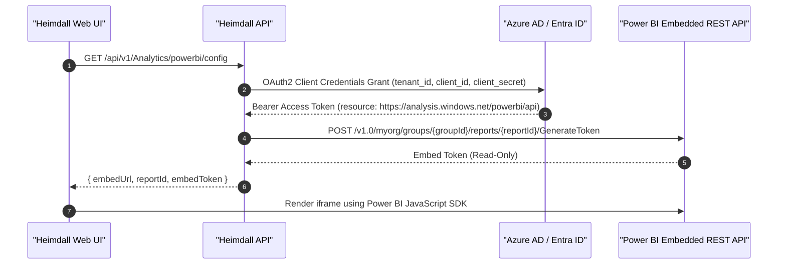

# Business Intelligence, Power BI Embedded & Reporting Integration

This document outlines the architecture, authentication, and data contracts for integrating Heimdall telemetry and operational data with enterprise BI platforms (Milestone 12, PM-005 and PM-006).

---

## 1. Supported BI Platforms

Heimdall natively supports three external reporting mechanisms:
1. **Microsoft Power BI Embedded**: Azure AD Service Principal direct embedding.
2. **Grafana**: Infinity JSON datasource plugin integration.
3. **Microsoft Excel / PowerQuery**: OData v4 live web feeds.

---

## 2. Microsoft Power BI Embedded (PM-005)

### Authentication Flow (Azure Service Principal)



### DirectQuery & Dataset Push Architecture
- Edge IPC telemetry is pushed periodically into the Power BI dataset via `POST /v1.0/myorg/groups/{groupId}/datasets/{datasetId}/tables/{tableName}/rows`.
- In offline or local development environments, Heimdall provides a simulated high-fidelity executive dashboard tile that binds directly to real-time plant telemetry.

---

## 3. Grafana Infinity Datasource (PM-006)

Grafana dashboards ingest Heimdall metrics using the **Infinity** JSON datasource plugin:

- **Endpoint**: `GET /api/v1/ReportExport/grafana/metrics`
- **Format**:
```json
[
  {
    "target": "heimdall.fleet.availability_pct",
    "datapoints": [
      [97.4, 1726190400000],
      [98.2, 1726204800000]
    ]
  },
  {
    "target": "heimdall.telemetry.cycle_time_ms",
    "datapoints": [
      [1195, 1726190400000],
      [1202, 1726204800000]
    ]
  }
]
```

---

## 4. Excel & PowerQuery Live OData Feeds (PM-006)

Engineers can connect Excel directly to live plant metrics:
1. In Excel, go to **Data > Get Data > From Other Sources > From OData Feed** (or **From Web**).
2. Enter the URL:
   - Live Telemetry: `http://<heimdall-host>:5099/api/v1/ReportExport/odata/telemetry`
   - Plant Machinery: `http://<heimdall-host>:5099/api/v1/ReportExport/odata/machines`
3. PowerQuery automatically expands the JSON `@odata.context` payload into tabular rows with automatic type detection and scheduled background refresh.
