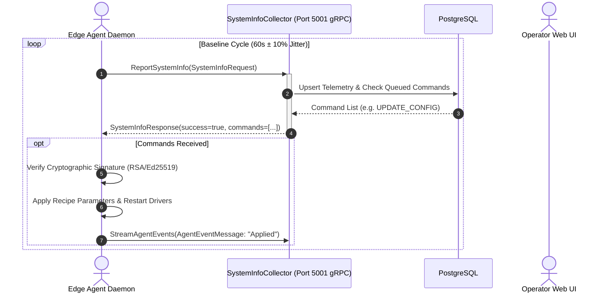

# Industrial Edge Agent & Protocol Specification

This document details the architecture, execution lifecycle, scheduling algorithms, bandwidth throttling, offline spooling, and industrial protocol drivers of the Heimdall Edge Agent daemon (`App.Agent.Daemon`).

---

## 1. Daemon Lifecycle & Execution Architecture

The Heimdall Agent runs as a continuous background daemon on edge compute hardware (Windows IoT Enterprise, Beckhoff TwinCAT/BSD, Debian Industrial, Ubuntu Core). It bridges fieldbus devices, PLCs, and operating systems with central telemetry services.

```
┌──────────────────────────────────────────────────────────────────────────────┐
│                         HEIMDALL EDGE AGENT DAEMON                           │
│                                                                              │
│  ┌───────────────────────┐  ┌───────────────────────┐  ┌──────────────────┐  │
│  │   Recipe Engine &     │  │  Multi-Recipe Runtime │  │  Deadband & Delta│  │
│  │   Crypto Verifier     │──│  Merger (DAG Engine)  │──│  Evaluator       │  │
│  │   (RSA / Ed25519)     │  │  (CSTK Deduplication) │  │  (xxHash64)      │  │
│  └───────────────────────┘  └───────────┬───────────┘  └─────────┬────────┘  │
│                                         │                        │           │
│                                         ▼                        ▼           │
│  ┌────────────────────────────────────────────────────────────────────────┐  │
│  │              Unified Scheduled Poller & Physical Drivers               │  │
│  │  [TwinCAT ADS / EtherCAT]   [OPC UA Client]   [Modbus TCP]   [OS Probes]│  │
│  └──────────────────────────────────────┬─────────────────────────────────┘  │
│                                         │                                    │
│                                         ▼                                    │
│  ┌────────────────────────────────────────────────────────────────────────┐  │
│  │ 4-Tier Priority Channel Router (P0 Critical -> P3 Bulk)                │  │
│  └──────────────────────────────────────┬─────────────────────────────────┘  │
│                                         │                                    │
│                                         ▼                                    │
│  ┌────────────────────────────────────────────────────────────────────────┐  │
│  │ Token Bucket Egress Limiter & Adaptive Zstandard Compression           │  │
│  └──────────────────────────────────────┬─────────────────────────────────┘  │
│                                         │                                    │
│                                         ▼                                    │
│  ┌────────────────────────────────────────────────────────────────────────┐  │
│  │ Local Store-and-Forward Spooler (SQLite Write-Ahead Logging)           │  │
│  └──────────────────────────────────────┬─────────────────────────────────┘  │
└─────────────────────────────────────────┼────────────────────────────────────┘
                                          │ TLS 1.3 / Cleartext gRPC (HTTP/2)
                                          ▼
                             Heimdall Backend (Port 5001)
```

### 1.1 Initialization & Anti-Thundering-Herd Jitter
When hundreds of industrial controllers restart simultaneously (for example, following a plant-wide power interruption), immediate simultaneous network connections can overwhelm network switches and central collectors.

The daemon prevents this by introducing a randomized startup delay:
$$\Delta t_{\text{startup}} \sim \text{Uniform}(0, 10\,000\text{ ms})$$

### 1.2 Polling Loop & Drift Compensation
The background worker executes on a baseline cycle (default: 60 seconds) modulated with $\pm 10\%$ jitter to avoid cyclical lockstep with other nodes:
$$T_{\text{cycle}} = T_{\text{base}} \pm \text{Uniform}(-0.10 \cdot T_{\text{base}}, +0.10 \cdot T_{\text{base}})$$

### 1.3 Local Diagnostic Web API
The daemon hosts an internal HTTP listener on `http://localhost:5998` bound strictly to loopback:
* `GET /api/config`: Returns active local node configuration (anonymized).
* `POST /api/config`: Updates local collection parameters.
* `GET /api/health`: Reports driver connectivity, queue depths, and spooler storage usage.

---

## 2. Declarative Recipe Engine & Schema

A **Recipe** is a declarative configuration document specifying what data points to collect, from which hardware driver, at what frequency, and under what deadband thresholds.

### 2.1 JSON Schema
```json
{
  "$schema": "https://json-schema.org/draft/2020-12/schema",
  "title": "HeimdallRecipe",
  "type": "object",
  "required": ["recipeId", "version", "name", "targetSelector", "dataPoints", "security"],
  "properties": {
    "recipeId": { "type": "string", "format": "uuid" },
    "version": { "type": "string", "pattern": "^[0-9]+\\.[0-9]+\\.[0-9]+$" },
    "name": { "type": "string" },
    "description": { "type": "string" },
    "targetSelector": {
      "type": "object",
      "properties": {
        "osPlatform": { "type": "string", "enum": ["Windows", "Linux", "Any"] },
        "controllerRoles": { "type": "array", "items": { "type": "string" } },
        "tags": { "type": "object", "additionalProperties": { "type": "string" } }
      }
    },
    "security": {
      "type": "object",
      "required": ["keyId", "algorithm", "signature", "canonicalHash"],
      "properties": {
        "keyId": { "type": "string" },
        "algorithm": { "type": "string", "enum": ["RSA-SHA256", "Ed25519"] },
        "signature": { "type": "string" },
        "canonicalHash": { "type": "string" }
      }
    },
    "dataPoints": {
      "type": "array",
      "items": {
        "type": "object",
        "required": ["pointId", "sourceDriver", "target", "category", "strategy"],
        "properties": {
          "pointId": { "type": "string" },
          "sourceDriver": { 
            "type": "string", 
            "enum": ["BeckhoffAds", "BeckhoffEtherCat", "SystemCim", "SystemProcess", "SystemDisk", "SystemFileSystem", "OpcUaSubscription", "ModbusTcp"] 
          },
          "target": { "type": "object" },
          "category": { 
            "type": "string", 
            "enum": ["Scalar", "List", "Map", "NestedObject", "Metric", "DeviceState"] 
          },
          "strategy": {
            "type": "object",
            "required": ["type", "intervalMs"],
            "properties": {
              "type": { "type": "string", "enum": ["Periodic", "ChangeOfValue", "OnDemand"] },
              "intervalMs": { "type": "integer", "minimum": 10 },
              "deadband": {
                "type": "object",
                "properties": {
                  "type": { "type": "string", "enum": ["Absolute", "Percentage", "StateChangeOnly"] },
                  "threshold": { "type": "number" },
                  "maxQuietPeriodMs": { "type": "integer" }
                }
              }
            }
          }
        }
      }
    }
  }
}
```

---

## 3. Multi-Recipe Runtime Merger DAG

Multiple operational teams (e.g., Quality Assurance, Maintenance, Controls Engineering) may independently deploy recipes to the same edge node. Executing them as separate independent pollers would cause redundant network traffic, redundant PLC CPU cycles, and duplicate fieldbus packets.

The **Multi-Recipe Runtime Merger** consolidates multiple recipes into a single execution Directed Acyclic Graph (DAG):

### 3.1 Canonical Source Target Key (CSTK) Deduplication
Every data point target is normalized into a deterministic string key:
$$\text{CSTK} = \text{DriverType} : \text{TargetAddress} : \text{ResourcePath}$$

* Example: Two separate recipes requesting Beckhoff TwinCAT tag `MAIN.stRobot.fActualTorque` generate identical CSTKs:
  `BeckhoffAds:192.168.1.10.1.1:851:MAIN.stRobot.fActualTorque`
* The engine merges these into **exactly one physical hardware probe**.

### 3.2 Strictest Minimum-Interval Scheduling
If recipe $A$ requests a tag every $1\,000\text{ ms}$ and recipe $B$ requests the same tag every $250\text{ ms}$, the merged probe executes at:
$$T_{\text{exec}} = \min(T_1, T_2, \dots, T_k) = 250\text{ ms}$$
When a sample arrives, it is dispatched immediately to the $250\text{ ms}$ subscriber, and decimated (downsampled) for the $1\,000\text{ ms}$ subscriber.

### 3.3 Scope & Property Union
* For WMI / CIM queries: When multiple queries inspect `Win32_OperatingSystem`, their projected property lists are merged via set union ($\bigcup \text{Columns}$), running a single query rather than multiple WMI round-trips.
* For Process monitoring: Inspection depth promotes to $\max(\text{Depth}_1, \dots, \text{Depth}_k)$.

---

## 4. Deadband & Delta Evaluator

To prevent transmission of unchanged readings, every incoming measurement passes through the `DeadbandEvaluator`:

1. **Absolute Deadband**:
   Suppresses readings where:
   $$|V_{\text{current}} - V_{\text{previous}}| < \text{Threshold}$$
2. **Percentage Deadband**:
   Suppresses readings where:
   $$\frac{|V_{\text{current}} - V_{\text{previous}}|}{|V_{\text{previous}}|} \times 100 < \text{Threshold}\%$$
3. **High-Speed Non-Cryptographic Layout Hashing (`xxHash64`)**:
   For complex DUT structs, array payloads, and maps, numeric deadband calculations are impractical. The evaluator serializes the memory buffer and computes a 64-bit hash via `System.IO.Hashing.XxHash64`. If the hash matches the previous sample, the reading is dropped as zero-delta in microseconds.
4. **Heartbeat TTL Synchronization (`maxQuietPeriodMs`)**:
   If a measurement remains steady for longer than `maxQuietPeriodMs` (default: 15 minutes), the deadband filter is bypassed and a forced heartbeat reading is emitted (`isHeartbeatForced = true`). This confirms to the backend that the edge sensor is alive and operational.

---

## 5. Bandwidth Throttling & Priority Egress

The agent implements a 4-tier prioritized queue architecture to protect factory network bandwidth:

| Priority Tier | Max Queue Size | Target Flush Latency | Flush Trigger Condition | Typical Payload Types |
| :--- | :--- | :--- | :--- | :--- |
| **`P0_CriticalAlarm`** | Unbounded | **< 10 ms** | Immediate (0 batch delay) | Emergency stops, safety interlocks, EtherCAT frame drop, thermal limits. Bypasses rate limits. |
| **`P1_HighOperational`** | 5,000 items | **< 200 ms** | ≥ 10 items or 200 ms elapsed | Soft-PLC state transitions (`Run` → `Stop`), drive error fault codes. |
| **`P2_MediumMetrics`** | 20,000 items | **1 s - 5 s** | ≥ 100 items or 2,000 ms elapsed | Spindle speed RPM, pneumatic line pressure, motor torque. |
| **`P3_LowInventory`** | 50,000 items | **5 m - 15 m** | ≥ 1,000 items or 5 mins elapsed | Installed software versions, SMART disk wear metrics, OS patch levels. |

### Dynamic Alarm Threshold Escalation
If a standard metric in tier `P2` (e.g., motor temperature) breaches an alarm threshold ($T > 85^\circ\text{C}$), the evaluator automatically promotes that specific telemetry packet to **`P0_CriticalAlarm`**, flushing it to the network immediately.

### Token Bucket Rate Limiter
Enforces a configurable ceiling (default: 256 KB/s) on telemetry egress. Tokens refill continuously based on elapsed wall-clock milliseconds. `P0` packets are exempt from token consumption.

### Adaptive Compression
Outgoing batch payloads ≥ 256 bytes are compressed using **Zstandard (`zstd` Level 3)**, achieving 60–80% compression ratios on repetitive industrial telemetry data while maintaining low CPU overhead.

---

## 6. Offline Store-and-Forward Spooling

During network partitions or central server maintenance, the agent buffers high-priority telemetry (`P0` and `P1`) in a local zero-allocation SQLite database:

* **File Location**: `/var/spool/heimdall/telemetry.db` (Linux) or `%ProgramData%\Heimdall\telemetry.db` (Windows).
* **Storage Engine Configuration**:
  ```sql
  PRAGMA journal_mode = WAL;
  PRAGMA synchronous = NORMAL;
  PRAGMA temp_store = MEMORY;
  PRAGMA auto_vacuum = INCREMENTAL;
  ```
* **Spool Table Schema**:
  ```sql
  CREATE TABLE IF NOT EXISTS telemetry_spool (
      id INTEGER PRIMARY KEY AUTOINCREMENT,
      priority INTEGER NOT NULL,
      created_at TEXT NOT NULL,
      payload BLOB NOT NULL
  );
  CREATE INDEX IF NOT EXISTS idx_spool_priority_id ON telemetry_spool (priority ASC, id ASC);
  ```
* **Drain Algorithm**: When network connectivity returns, a spool worker drains records in FIFO order per priority tier using exponential backoff with full jitter:
  $$t_{\text{backoff}} = \min\left(t_{\max}, t_{\text{base}} \cdot 2^{\text{attempt}}\right) + \text{Uniform}(0, \text{Jitter})$$

---

## 7. Industrial Protocol Drivers & Specifications

### 7.1 Beckhoff TwinCAT ADS & EtherCAT Diagnostics
* **ADS Architecture**: Implemented using `Beckhoff.TwinCAT.Ads` with a managed in-process router (`AmsTcpIpRouter`) that communicates directly over TCP port 48898 without requiring the proprietary TwinCAT XAE runtime to be installed on Linux hosts.
* **Standard Ports**:
  * Port `10000`: TwinCAT System Service (queries runtime state: Run, Config, Stop).
  * Port `851`: TwinCAT 3 PLC Runtime 1 (symbol browsing and data reading).
  * Port `0xFFFF`: EtherCAT Master diagnostics.
* **ADS Sum Commands (`0xF080`)**:
  Rather than issuing hundreds of individual network requests, the driver packs multiple symbol handles into a single ADS Sum Command request. The TwinCAT PLC resolves all tags in memory in a single cycle and returns a single concatenated response buffer.
* **EtherCAT Master Diagnostic Registers**:
  * IndexGroup `0x00000003`, Offset `0x00000100`: EtherCAT Master State (`0x1`=INIT, `0x2`=PREOP, `0x3`=BOOT, `0x4`=SAFEOP, `0x8`=OP).
  * `DevState` Bitmask:
    * `0x0001`: Physical link error on primary port.
    * `0x0004`: Out of memory error.
    * `0x0008`: Missing cyclic frames (frame dropped by network switch or cable defect).
    * `0x0800`: At least one slave in error state.
    * `0x1000`: Distributed Clocks (DC) synchronized flag lost.
  * IndexGroup `0x00000009`: Reads full slave topology array (`ST_EcSlaveState`).
  * IndexGroup `0xF302`: CAN application protocol over EtherCAT (CoE) SDO read/write.
  * Register range `0x0300..0x0307`: Hardware ESC physical CRC error counters per port.

### 7.2 TcOpen OOP Standard & Standalone Double-Buffered Bridge
* **`ITcoHeimdallTelemetry` Contract**:
  Industrial software implementing the TcOpen framework standardizes telemetry via an interface defining:
  ```pascal
  INTERFACE ITcoHeimdallTelemetry EXTENDS ITcoComponent
  METHOD UpdateTelemetry : BOOL
  PROPERTY SequenceId : ULINT
  ```
  Components output their data into a flat, strongly-typed `_data` variable containing pure IEC standard types (scalars, DUTs, flat arrays).
* **Pointer-Free Network Safety**:
  The Heimdall Agent reads `<SymbolPath>._data` as a fixed byte layout. It never attempts to dynamically traverse `POINTER TO` or `REFERENCE TO` fields across the network, eliminating memory violation risks in real-time PLC kernels.
* **`FB_HeimdallTelemetryBridge` (Standalone TwinCAT 3)**:
  For vanilla TwinCAT projects not using TcOpen, Heimdall provides a drop-in Function Block (`FB_HeimdallTelemetryBridge.TcPOU`) implementing lock-free double buffering (`stTelemetryBuffer[0..1]`). While the PLC cyclic task writes to buffer index $i$, external ADS clients read from index $1 - i$. A sequence counter validates that no torn reads occurred during copy.

### 7.3 OPC UA Client Driver
* **Protocol Implementation**: Utilizes the OPC Foundation standard stack (`OPCFoundation.NetStandard.Opc.Ua`).
* **Security Policies Supported**: `Basic256Sha256`, `Aes128_Sha256_RsaOaep`, and `None` (test environments).
* **Session Resilience**: Keepalive heartbeat loop monitors server reachability and triggers automated reconnection sequences with session state recovery upon PLC reboots.
* **Address Space Traversal**: Uses continuation points to paginate large address spaces without exceeding server PDU limits.
* **Subscription Management**: Configures server-side analog deadbands to minimize network events at the source.

### 7.4 Modbus TCP Driver
* **Supported Function Codes**:
  * `FC01`: Read Coils
  * `FC02`: Read Discrete Inputs
  * `FC03`: Read Holding Registers
  * `FC04`: Read Input Registers
  * `FC16`: Write Multiple Registers
* **Endianness Conversion**:
  Different PLC manufacturers represent 32-bit floating-point numbers across two 16-bit registers differently. The driver provides 4 stack-allocated decoders:
  * `CDAB`: Word-Swapped / Mid-Big Endian (Standard for Schneider Electric, ABB, and most industrial meters).
  * `ABCD`: Big-Endian (Siemens S7).
  * `BADC`: Mid-Little Endian.
  * `DCBA`: True Little-Endian (Intel x86 native).
* **Contiguous Register Optimizer**:
  If multiple requests target registers separated by a gap of ≤ 5 unused registers, the driver merges them into a single contiguous block read (up to 120 registers) to eliminate network latency.

### 7.5 Operating System & Hardware Inspection Probes
* **Windows Hardware Probes**:
  * P/Invoke queries against `setupapi.dll` and `cfgmgr32.dll` matching `GUID_DEVCLASS_NET` to detect installed Beckhoff Real-Time Virtual Ethernet adapters (`TcRTEthernet`, `TcEth`).
  * Registry scanner querying 32-bit and 64-bit uninstall hives:
    * `HKLM\SOFTWARE\Microsoft\Windows\CurrentVersion\Uninstall`
    * `HKLM\SOFTWARE\WOW6432Node\Microsoft\Windows\CurrentVersion\Uninstall`
* **Linux Kernel Probes**:
  * Directly reads and parses `/proc/cpuinfo`, `/proc/meminfo`, and `/proc/net/dev`.
  * Inspects `/sys/class/net/*/speed` and `/sys/class/net/*/operstate` for physical link diagnostics.
  * Systemd D-Bus interface for service lifecycle tracking.
* **Process CPU Delta Sampling**:
  Measures process CPU usage by recording user/kernel time deltas divided by system wall-clock elapsed time across sampling intervals, rather than relying on instantaneous, uncalibrated counters.


### 1.4 Agent-Backend Communication Sequence



---

## 8. Cryptographically Signed Plugins, Sandboxing & Extension API

### 8.1 Master RSA-2048 Signing & Verification Pipeline
To prevent unauthorized code execution on critical OT controllers while enabling safe third-party extensibility, the agent implements cryptographic verification for dynamic plugins:
- **Central Authority**: `PluginService` in the backend API maintains an RSA-2048 signing authority. When a plugin package is published, all files are canonically sorted and hashed using SHA-256 to compute a deterministic `PayloadHash`.
- **Digital Signatures**: The backend signs the payload hash using `RSA-SHA256` with `Pkcs1` padding.
- **Agent Verification**: `PluginManager` independently re-hashes extracted files and validates the digital signature against `ServerPublicKey`. Any modification or file tampering fails validation immediately.

### 8.2 Production Fail-Secure vs. Development Sandboxing
- **Production Mode**: When running in Production (`Environment == "Production"`), unsigned or invalidly signed plugins are strictly rejected with `ErrorCode.PluginSignatureInvalid`. Unsigned execution is impossible.
- **Development Sandboxing**: In non-production environments with `AllowUnsignedPlugins == true`, developers can test experimental sensor drivers inside an isolated sandbox (`sandboxes/{pluginId}/`).

### 8.3 Secret Scrubbing & Path Traversal Protections
- **Secret Scrubbing**: Sensitive environment variables (`HEIMDALL_AGENT_KEY`, `HEIMDALL_MASTER_PRIVATE_KEY`, `HEIMDALL_ENCRYPTION_KEY`) are stripped before spawning child plugin processes.
- **Path Containment**: `PathSanitizer.IsWithinRoot` ensures extraction targets cannot escape the plugin root directory via directory traversal sequences (`../`).
- **Process Supervision**: Plugin processes run with strict execution timeouts controlled via `CancellationTokenSource`.

### 8.4 Local Extension REST API (`/api/v1/extensions/*`)
For local applications (e.g., Python vision algorithms, barcode scanners, proprietary C++ test benches), the daemon exposes an authenticated HTTP REST interface:
- `GET /api/v1/agent/status`: Status check and health reporting.
- `POST /api/v1/extensions/components`: Register custom hardware sensors or sub-devices.
- `POST /api/v1/extensions/telemetry`: Push custom time-series measurements.
- `POST /api/v1/extensions/events`: Stream custom alarms and operational events.
- `POST /api/v1/agent/sync`: Trigger immediate synchronization to the backend.
- Guarded by `ExtensionAuthFilter` using constant-time token comparisons (`CryptographicOperations.FixedTimeEquals`).

### 8.5 Component Tree Integration & Inventory Attachment
Custom components registered via the Extension API are merged into the machine hierarchy:
- `ExtensionComponentContributor` packages active sensors into the agent's gRPC payload.
- `SystemInfoCollectorService` links the sensor to its parent equipment using `BaseInventoryItem.ParentId`.
- The Station Component Tree modal (`StationComponentTreeModal.vue`) displays custom sensors with `[Signed]` and `[Dev Sandbox]` trust badges, allowing operators to inspect dynamic JSON state directly from the CAD map or machinery views.

---

## 9. Beckhoff TwinCAT ADS Simulation Server (Port 48898)

The agent daemon includes a high-performance in-memory Beckhoff TwinCAT ADS simulation server (`AdsSimulationServer.cs`) listening on standard ADS TCP port **48898**:
* **AMS Net ID**: `5.80.201.44.1.1:851` (TwinCAT 3 PLC Runtime 1).
* **AMS/TCP Protocol Framing**:
  * Decodes 6-byte AMS/TCP headers and 32-byte AMS packet headers.
  * `0x0001` (`ADSCMD_READ_DEVICE_INFO`): Returns TwinCAT 3.1 PLC Runtime, Build 4026.11.
  * `0x0004` (`ADSCMD_READ_STATE`): Returns current PLC state (`ADSSTATE_RUN = 5` or `ADSSTATE_STOP = 6`).
  * `0x0005` (`ADSCMD_WRITE_CONTROL`): Allows remote or local switching between RUN, STOP, and RESET states.
  * `0x0002` (`ADSCMD_READ`) / `0x0009` (`ADSCMD_READ_WRITE`): Serves live simulated PLC variables:
    * `MAIN.CycleCounter` (incrementing 32-bit counter)
    * `MAIN.TemperatureDegC` (sine-wave oscillation: 62.0 °C ± 8.5 °C)
    * `MAIN.PressureBar` (harmonic oscillation: 6.0 bar ± 0.35 bar)
    * `MAIN.MachineRunning` (Boolean: true)
    * `MAIN.PartsProduced` (DINT part accumulation)
    * `MAIN.DriveSpeedRpm` & `MAIN.LineCurrentAmps`
* **Zero-Allocation Struct Unmarshalling**: Compatible with `StructTelemetryBinder.cs` for direct memory-mapped buffer translation.

---

## 10. Minimal OPC UA Client (Port 4840)

To connect with third-party controllers without external heavy SDK dependencies, the agent provides `MinimalOpcClient.cs`:
* **OPC UA Binary Protocol**: Implements standard binary socket communication (`HEL`/`ACK` handshake with message sizing and buffer negotiation).
* **Virtual Simulation Fallback**: When an external OPC UA server is offline, the client automatically engages simulated telemetry generation, ensuring uninterrupted local diagnostics.
* **Monitored Node Registry**:
  * `ns=2;s=Line01.DriveSpeed`: Main motor speed (RPM)
  * `ns=2;s=Line01.MotorCurrent`: Load current (Amperes)
  * `ns=2;s=Line01.QualityOk`: Automated yield qualification (Boolean)
  * `ns=2;s=Line01.PartCount`: Batch cycle accumulation
* **Telemetry Pipeline Integration**: Polled OPC metrics are attached to `IndustrialOtData` and dispatched directly into the central gRPC collector.

---

## 11. Reporting Trigger Engine & Selective Slice Filtering

To eliminate redundant bandwidth usage across industrial OT networks, telemetry dispatch is governed by `TelemetryTriggerEngine.cs`:
* **`HeartbeatTrigger`**: Ensures connectivity liveness at configurable intervals (default: 60s). Sends lightweight liveness slices (`HeartbeatOnly`).
* **`ThresholdTrigger`**: Monitors metric thresholds:
  * OS Drive free space $\le 15$ GB: Triggers `P1_HighOperational`.
  * OS Drive free space $\le 5$ GB: Escalates to `P0_CriticalAlarm`.
  * TwinCAT PLC temperature $\ge 75.0$ °C: Escalates to `P0_CriticalAlarm`.
* **`StateChangeTrigger`**: Detects state transitions:
  * TwinCAT ADS state change (e.g. `RUN (5)` &rarr; `STOP (6)` or `ERROR (11)`).
  * Network interface state change or machine identity reconfiguration.
* **`OnDemandTrigger`**: Immediately fires upon manual request via the Agent Web Dashboard, Taskbar Tray Icon, or gRPC backend command.
* **Selective Data Slice Filtering**:
  * When only a metric or PLC variable changes, unchanged static hardware (`HardwareInfo`) and installed software (`SoftwareInfo`) slices are omitted, achieving up to 90% bandwidth reduction.

---

## 12. Windows Taskbar Tray Icon & Modernized Agent Web-View

* **Taskbar Tray Runner (`HeimdallTrayRunner.ps1`)**:
  * Lives in the Windows system tray notification area with a Heimdall shield icon.
  * Real-time tooltip: `Heimdall Industrial Edge Agent | ADS: 48898 RUN | OPC: Connected`.
  * Context Menu:
    * *Open Agent Web Dashboard* (launches `http://localhost:5998`)
    * *Trigger Immediate Telemetry Report* (dispatches instant telemetry with balloon confirmation)
    * *Toggle TwinCAT ADS State* (RUN / STOP)
    * *View Agent Status Summary*
    * *Restart Agent Service*
* **Modernized Web Dashboard (`http://localhost:5998`)**:
  * Industrial dark-theme interface matching Heimdall design language.
  * Live status cards: Host Environment, TwinCAT ADS Simulation, Minimal OPC UA Client, and Trigger Engine.
  * Diagnostic and control APIs: `GET /api/status`, `POST /api/trigger-report`, `POST /api/ads/toggle`, and `GET/POST /api/config`.


