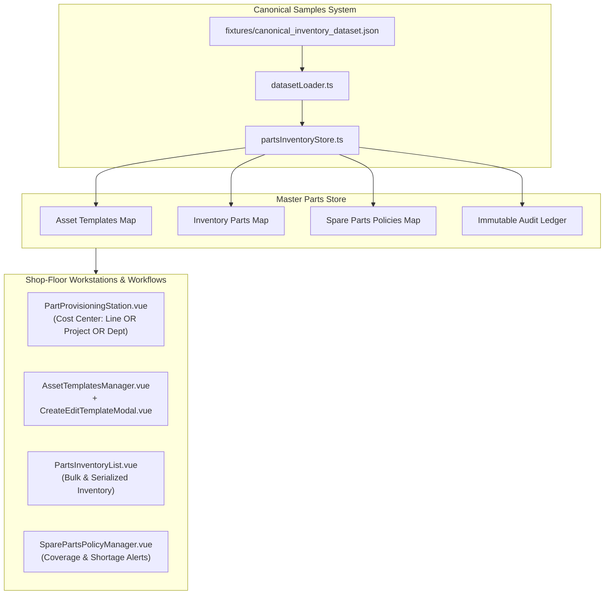

# Parts Inventory, Provisioning & Asset Templates Architecture

## 1. Overview & Architectural Scope

The Heimdall Parts Inventory & Asset Provisioning system decouples factory equipment assets into discrete lifecycle phases:
1. **Warehouse Inventory Stock**: Tracks physical serialized units and bulk consumables maintained on factory shelves prior to machine installation.
2. **Dedicated Provisioning Workstation**: High-speed shop-floor terminal enforcing strict cost center accountability (OR relation: Production Line OR Project OR Department) when parts are dispatched.
3. **Asset Templates & OOP Blueprint Inheritance**: Reusable definitions with fixed OEM specifications, sequential identifier generation schemes (`AST-{number}`), and dynamic instance schemas.
4. **Machine Spare Parts Policies**: Intelligent policy calculation using fractional machine ratios, active production scaling, scalar safety buffers, and budgetary upper bounds.
5. **Canonical Fixtures Architecture**: Deterministic seed system backed by canonical JSON fixtures and `datasetLoader.ts`, removing hardcoded in-memory state.



---

## 2. Core Data Models & Canonical Dataset

### 2.1 Asset Template Definition (`AssetTemplateDefinition`)
Templates act as object-oriented classes from which physical serialized units are instantiated:
* **`id`**: Unique identifier (e.g. `tmpl-ipc-controller`).
* **`topLevelCategory`**: `Hardware` or `Software`.
* **`extendsTemplateId`**: References parent template for OOP attribute inheritance.
* **`identifierPattern`**: Pattern containing `{number}` (e.g. `IPC-{number}`, `CAM-{number}`).
* **`sequentialCounter`**: Monotonically increasing counter for automatic custom ID assignment.
* **`fixedFields`**: Common specifications shared by all units (`manufacturer`, `supplier`, `basePriceEur`, `specs`, `defaultOwner`).
* **`instanceSpecificFieldsSchema`**: Schema definitions for fields supplied during individual unit intake (`key`, `label`, `type`, `required`, `defaultValue`, `options`).

### 2.2 Inventory Part (`InventoryPart`)
Represents an individual physical unit or bulk stock item:
* **`trackingType`**:
  * `serialized`: Distinct unit with quantity = 1, unique serial number, individual wear depreciation, and operational state transitions.
  * `bulk`: Batch-counted consumables with continuous stock quantity management.
* **`condition`**: Lifecycle physical health (`new`, `used`, `donor`, `obsolete`, `scrap`).
* **`operationalState`**: Functional readiness (`working`, `in_service`, `broken`, `evaluation`).
* **`minQuantityScalar` & `effectiveMinQuantity`**:
  $$\text{effectiveMinQuantity} = \text{round}(\text{minQuantity} \times \text{minQuantityScalar}, 2)$$
  Provides dynamic safety buffer multipliers for critical lines.
* **`wearDepreciationPercentage` & `estimatedResellPriceEur`**:
  $$\text{estimatedResellPriceEur} = \text{basePriceEur} \times \left(1 - \frac{\text{wearDepreciationPercentage}}{100}\right)$$

### 2.3 Machine Spare Part Policy (`MachineSparePartItem`)
Defines the plant spare stocking requirement:
* **`fractionalRatio`**: Target spare ratio per machine (e.g. `0.25` = 1 spare per 4 machines).
* **`activeMachinesInProduction`**: Count of operating machine hosts.
* **`requiredSparesCalculated`**:
  $$\text{Calculated} = \max\left(\lceil \text{activeMachines} \times \text{fractionalRatio} \rceil, \lceil \text{effectiveMin} \rceil\right)$$
* **Upper Bound Overrides**:
  * `upperBoundQuantity`: Hard limit on max spares ordered regardless of formula.
  * `upperBoundCostEur`: Hard financial ceiling on holding valuation.

---

## 3. Mandatory Cost Center Validation (Strict OR Relation)

When parts are dispatched or provisioned via `usePart`:
* **Validation Rule**:
  $$\text{Valid} \iff (\text{prodLine} \neq \emptyset) \lor (\text{project} \neq \emptyset) \lor (\text{department} \neq \emptyset)$$
* An **AND relation is explicitly rejected**; technicians are not blocked by requiring all three tags simultaneously. Providing any single valid cost center satisfies accounting accountability.

```typescript
const hasProdLine = Boolean(costCenter?.prodLine && costCenter.prodLine.trim())
const hasProject = Boolean(costCenter?.project && costCenter.project.trim())
const hasDepartment = Boolean(costCenter?.department && costCenter.department.trim())

if (!hasProdLine && !hasProject && !hasDepartment) {
  throw new Error('Mandatory cost center tagging required: specify at least one of Production Line (prodLine), Project (project), or Department (department).')
}
```

---

## 4. Workstations & User Interfaces

### 4.1 Master Page (`inventory.vue`)
The inventory module provides 6 primary workspaces with an interactive Hero KPI overview:
1. **Warehouse Inventory** (`PartsInventoryList.vue`): Search, filters, bulk/serialized stock badges, and stock alert levels.
2. **Provisioning Station** (`PartProvisioningStation.vue`): Interactive workshop terminal for fast part lookup, wear inspection, scalar buffer verification, cost center allocation, and dispatch.
3. **Asset Templates** (`AssetTemplatesManager.vue`): Blueprint manager with tree expansion, OOP inheritance, serialized instance counts, and `CreateEditTemplateModal.vue`.
4. **Spare Parts & Policies** (`SparePartsPolicyManager.vue`): Machine spare coverage reporting, shortage alerts, and ratio/bound tuning.
5. **Production Machines** (`DashboardInventoryTable.vue`): Machine-linked installed assets and CAD component hierarchy.
6. **Audit Ledger** (`PartAuditLogDrawer.vue`): Complete chronological audit log of all intakes, usage dispatches, and condition updates.

---

## 5. REST & Nitro BFF API Endpoints

| Method | Endpoint | Description |
|---|---|---|
| `GET` | `/api/inventory/parts` | Filtered warehouse parts with currency conversion & KPIs |
| `POST` | `/api/inventory/parts` | Log new part into stock |
| `POST` | `/api/inventory/parts/bulk-log` | Batch intake from JSON or tabular format |
| `POST` | `/api/inventory/parts/:id/use` | Provision part with mandatory OR cost center |
| `PATCH` | `/api/inventory/parts/:id/patch` | Update condition, operational state, or wear |
| `GET` | `/api/inventory/parts/audit` | Global immutable audit ledger |
| `GET` | `/api/inventory/templates/tree` | Template hierarchy tree with instantiated units |
| `POST` | `/api/inventory/templates` | Create a new asset template |
| `PATCH` | `/api/inventory/templates/:id` | Update template specs and instance schema |
| `DELETE` | `/api/inventory/templates/:id` | Delete template (safely protected against referenced items) |
| `GET` | `/api/inventory/spare-parts` | Spare parts policy list and coverage calculation |
| `POST` | `/api/inventory/machine-import` | AI/ChatGPT BOM extraction and automated part intake |
