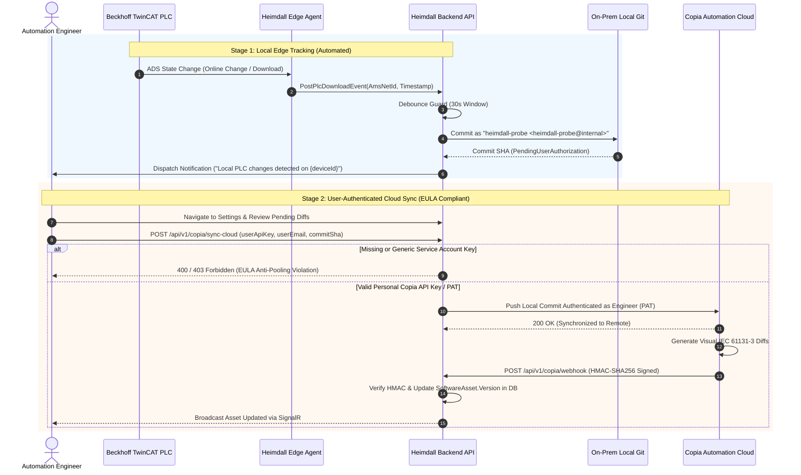

# TwinCAT 3 & Copia Automation Integration Architecture

## 1. Executive Summary & Overview

Heimdall integrates directly with **Beckhoff TwinCAT 3** industrial controllers and **Copia Automation** (Git-based industrial version control) to provide automated version tracking, code integrity audits, and change detection on the factory floor.

### 1.1 Copia EULA & Terms of Service Compliance (Anti-User-Pooling)

Copia Automation operates under a **seat-based named user licensing model**, governed by the [Copia Terms of Service](https://copia.io/terms-of-service/). Key contractual stipulations include:

- **Exhibit A ("Authorized User")**:
  > *"‘Authorized User’ means any individual (in each case to the extent that Licensee’s license includes, and Licensee pays for, such individual) who is authorized to access the Product, Documentation or Services and exercise the rights licensed by Licensee. Each Authorized User must use a unique identity to access and use the Product unless otherwise licensed, and may access the services only to the extent licensed by Licensee."*
- **Section 1.3(d) (Restrictions)**:
  > *"Licensee agrees that it (and its Authorized Users) will not without express written permission of Copia: ... (d) permit direct or indirect access to, or use of, the Services in a way that circumvents any contractual usage limit;"*
- **Section 3(b) (Account Confidentiality & Responsibility)**:
  > *"Licensee is Responsible for its Authorized Users and Each of Their Accounts. ... Licensee shall require Authorized Users to maintain proper password security, and to keep their accounts confidential."*

Under these provisions, routing modifications made by various plant engineers through a single generic "service account" or shared headless API key directly violates the unique identity mandate and circumvents seat-based usage limits ("user pooling").

To maintain 100% compliance with Copia's Terms of Service and security architecture, Heimdall enforces a **Two-Stage PLC Version Tracking Model**:

1. **Stage 1 (Local Edge Tracking - Automated Service User)**:
   - When TwinCAT ADS runtime transitions (ADS downloads or online changes) occur on the OT network, changes are captured and committed strictly to an **on-premise local Git repository**.
   - This local tracking uses the internal service identity:
     - **Author**: `heimdall-probe`
     - **Email**: `heimdall-probe@internal`
   - **Crucially, Stage 1 never calls Copia Cloud Services or Cloud Infrastructure.** Because on-premise local Git operations are purely edge-hosted and never interact with Copia Cloud, using `heimdall-probe` for automated local edge tracking is fully compliant and incurs zero Copia seat consumption.
   - A pending change record (`PendingUserAuthorization`) and user notification are generated immediately.

2. **Stage 2 (User-Authenticated Cloud Sync - Personal API Key / Unique Identity)**:
   - When an automation engineer or plant operator receives the notification, they review the pending local diff in Heimdall.
   - To synchronize the commit to Copia Cloud (`POST /api/v1/copia/sync-cloud`), the engineer must authenticate using their **own personal Copia API Key / Personal Access Token (PAT)**.
   - The backend validates that the API key belongs to a named human engineer and **explicitly rejects** any attempts to use service account keys (such as `service-user`, `heimdall-probe`, or `shared-*`).
   - The cloud commit is attributed directly to the authenticated engineer's email, satisfying Copia's unique identity requirement under Exhibit A and Section 1.3(d).

### 1.2 Copia DeviceLink™ vs. Copia Source Control (No DeviceLink License Required)

A common enterprise licensing question is: **"Does this workflow operate as intended and is it legal if our organization only purchases Copia Source Control user seats, without a Copia DeviceLink™ device license?"**

**Answer: Yes, 100% legal and operational.** Here is why:

| Dimension | Copia DeviceLink™ (Proprietary Add-On) | Heimdall Two-Stage Integration (Source Control Seats Only) |
|---|---|---|
| **What It Is** | Copia's proprietary appliance agent that actively connects to physical PLCs over OT networks and initiates automated cloud commits. | Heimdall's own edge daemon (`heimdall-agent`) connects to TwinCAT via standard Beckhoff ADS and manages local on-prem Git tracking. |
| **Licensing Metric** | Per physical controller / connected asset. | **Zero DeviceLink licenses required.** Uses standard per-seat named user licenses for Copia Source Control. |
| **Edge Git Operations** | Managed by Copia DeviceLink cloud services. | Purely local on-premise Git repository using open-source Git tooling (`heimdall-probe`). Zero Copia Cloud involvement. |
| **Cloud Synchronization** | Fully automated background headless push to Copia Cloud. | Initiated by the authorized human engineer (`POST /api/v1/copia/sync-cloud` or `git push`) authenticated with their personal Copia PAT. |
| **Copia EULA & ToS Compliance** | Requires DeviceLink subscription per device. | Fully complies with Copia Terms of Service Exhibit A ("Authorized User") and Section 1.3(d). Pushing user-created or user-reviewed commits via standard Git or PAT is the core intended purpose of Copia Source Control seats. |

Because Heimdall performs all edge runtime monitoring and local change tracking independently, and synchronization to Copia Cloud is authorized by a licensed engineer under their personal credentials, **no Copia DeviceLink license is required or invoked.**

```
+-----------------------------------------------------------------------------------------+
|                                   FACTORY OT NETWORK                                    |
|                                                                                         |
|  +--------------------+           ADS Router           +-----------------------------+  |
|  | Beckhoff TwinCAT 3 | <============================> | Heimdall Agent (Daemon)     |  |
|  | IPC / CX Controller|     Download / State Change    | - ADS Port 10000 Monitor    |  |
|  +--------------------+                                | - Logic Checksum Hasher     |  |
|                                                        +--------------+--------------+  |
+-----------------------------------------------------------------------|-----------------+
                                                                        | HTTPS / SignalR
                                                                        v
+-----------------------------------------------------------------------------------------+
|                              HEIMDALL ON-PREM EDGE PLATFORM                             |
|                                                                                         |
|  +--------------------------------+       Commit       +-----------------------------+  |
|  | Heimdall Backend API           | -----------------> | Local On-Prem Git Repo      |  |
|  | - CopiaIntegrationService      |   (Stage 1)        | - User: heimdall-probe      |  |
|  | - Rate-Limiting Debouncer      |                    | - Status: PendingAuth       |  |
|  | - EULA Anti-Pooling Guard      |                    +-----------------------------+  |
|  +---------------+----------------+                                                     |
|                  | Generates Notification                                               |
|                  v                                                                      |
|  +--------------------------------+                                                     |
|  | Engineer Dashboard UI          |                                                     |
|  | - Settings / Security Tab      |                                                     |
|  | - Personal Copia PAT / API Key |                                                     |
|  +---------------+----------------+                                                     |
+------------------|----------------------------------------------------------------------+
                   | Stage 2 Sync with Personal Engineer API Key
                   v
+-----------------------------------------------------------------------------------------+
|                                  COPIA AUTOMATION CLOUD                                 |
|                                                                                         |
|  +--------------------------------+       Webhook      +-----------------------------+  |
|  | Copia Cloud Repository         | -----------------> | Heimdall Backend Ingestion  |  |
|  | - Attributed to Human Engineer |   HMAC-SHA256 Push | - SoftwareAsset Catalog     |  |
|  | - Visual IEC 61131-3 Diffs     |                    | - Audit Event Log           |  |
|  +--------------------------------+                    +-----------------------------+  |
|                                                                                         |
+-----------------------------------------------------------------------------------------+
```

---

## 2. TwinCAT Clean Repository Structure & Git Ignore Specifications

TwinCAT 3 project solutions (`.sln`) contain both XML-based source definitions (POUs, DUTs, GVLs, Hardware configurations) and volatile binary artifacts generated during local build and debug sessions. Tracking volatile files causes merge conflicts, repository bloat, and false-positive diffs in Copia.

### 2.1 Recommended Repository Structure

```
MyPlcSolution/
├── .gitignore
├── .gitattributes
├── README.md
├── MyPlcSolution.sln
└── MyTwinCatProject/
    ├── MyTwinCatProject.tsproj
    ├── _Config/
    │   ├── IO/
    │   └── PLC/
    └── MyPlc/
        ├── MyPlc.plcproj
        ├── DUTs/
        │   └── ST_MotorTelemetry.TcDUT
        ├── GVLS/
        │   └── GVL_Sensors.TcGVL
        ├── POUs/
        │   ├── MAIN.TcPOU
        │   └── FB_AxisController.TcPOU
        └── VISUs/
```

### 2.2 Standard Industrial `.gitignore` for Beckhoff TwinCAT 3

```gitignore
# ==============================================================================
# Heimdall Recommended .gitignore for Beckhoff TwinCAT 3 & Copia Automation
# ==============================================================================

# Visual Studio & TwinCAT Environment Volatiles
.vs/
*.suo
*.user
*.userprefs
*.sln.docstates
*.VisualState.xml

# TwinCAT Boot and Runtime Compilations
_Boot/
_CompileInfo/
*.tpy
*.compileinfo
*.bootdata
*.bootdata.old
*.compiled-library

# Backup and Temporary Storage
*.bak
*.autosave
*.tmp
*.~*
*.orig

# TwinCAT Archival Packages (should not be committed to Git)
*.tszip

# Symbol & Build Outputs
*.pdb
*.obj
*.bin
*.ilk

# OS & File System Artifacts
Thumbs.db
.DS_Store
desktop.ini
```

### 2.3 Essential `.gitattributes` for Merge & Diff Integrity

To ensure Copia accurately parses TwinCAT XML definitions and line endings across Windows engineering workstations:

```gitattributes
* text=auto eol=crlf
*.TcPOU text diff=pascal
*.TcDUT text diff=pascal
*.TcGVL text diff=pascal
*.tsproj text merge=union
*.plcproj text merge=union
```

---

## 3. ADS Login & Download Event Architecture

### 3.1 ADS State Lifecycle

TwinCAT runtime communication occurs over the **Automation Device Specification (ADS)** routing protocol (port 10000 on AMS Net ID target).

During engineering interventions, the following events occur:
1. **ADS Login**: An engineer attaches the TwinCAT XAE debugger to runtime port 851.
2. **Online Change**: Incremental code swap without stopping the PLC task cycle.
3. **Full Download**: Target PLC transitions from `ADSSTATE_STOP` to `ADSSTATE_RESET` to `ADSSTATE_RUN` with full memory re-allocation.

### 3.2 The Event Storm Problem

During commissioning, a PLC engineer may trigger dozens of online changes or ADS logins per minute. Naively triggering a Copia commit or cloud webhook on every raw ADS frame results in:
- Rate-limit exhaustion against the Copia REST API (`HTTP 429 Too Many Requests`).
- Redundant Git commit clutter consisting of incomplete, intermediate code snippets.
- Unnecessary network bandwidth utilization on cell-level industrial switches.

### 3.3 Rate-Limiting & Debouncing Architecture

Heimdall implements a two-tier debouncing algorithm in `CopiaIntegrationService`:

```
Incoming ADS Event (Download / Login)
                 │
                 ▼
  Extract `AmsNetId:EventType` Key
                 │
                 ▼
     Is Elapsed Time Since Last Event
     < Debounce Window (Default: 30s)?
           │               │
          Yes              No
           │               │
           ▼               ▼
      [DEBOUNCE]     [PROCESS EVENT]
     Drop duplicate   Update Timestamp
     Log debug msg    Execute Stage 1 Tracking
```

#### Algorithm Details
- **Debounce Window**: Configurable per controller (defaults to `30s` for online changes, `120s` for logins).
- **Concurrency**: Thread-safe evaluation via `ConcurrentDictionary<string, DateTimeOffset>`.
- **Sliding Guard**: If rapid continuous events occur, only the initial trigger and the final stable state trigger are forwarded.

---

## 4. Two-Stage Workflow & EULA Anti-Pooling Enforcement

### 4.1 Stage 1: Local On-Premise Git Tracking (`heimdall-probe`)

When an ADS event clears the debouncer:
1. **Heimdall Edge Agent** captures the PLC project files and hashes them.
2. **`ICopiaIntegrationService.TrackLocalPlcChangeAsync(...)`** creates a commit in the local edge Git repository:
   - **Commit Author**: `heimdall-probe <heimdall-probe@internal>`
   - **Commit Message**: `[heimdall-probe] Auto-tracked PLC changes for {deviceId} at {timestamp}`
   - **Status**: Recorded as `PendingUserAuthorization`.
3. **Notification Generation**:
   - An in-app notification is dispatched to engineers and dashboard users informing them that unpushed logic changes were captured locally.
   - The notification directs the engineer to review the pending sync.

### 4.2 Stage 2: User-Authenticated Cloud Sync (Personal Copia PAT)

To synchronize changes to Copia Cloud:
1. The engineer accesses **Settings > Security > Copia Automation Personal Credentials** (`/dashboard/settings`) or the pending changes card.
2. The engineer enters their personal Copia API key / PAT. Keys are stored per-user and never shared.
3. The engineer triggers **"Sync with My Key"** (`POST /api/v1/copia/sync-cloud`):
   - Payload: `{ deviceId, commitHash, userApiKey, userEmail }`
4. **Backend EULA Compliance Verification**:
   - If `userApiKey` is missing or empty, the sync is rejected (`HTTP 400`).
   - If `userApiKey` matches known service patterns (`service-user`, `heimdall-probe`, `shared-*`, etc.), the backend throws an `InvalidOperationException`:
     > *"Copia EULA Compliance Violation: Automated cloud sync using generic service account keys is prohibited by Copia Terms of Service (Section 1.3(d) & Exhibit A). Each user must authorize sync with their personal Copia API key to avoid user pooling."*
   - Once validated, the commit is pushed to Copia Cloud authenticated as the individual engineer using their personal token.
   - The `SoftwareAsset` catalog is updated with the new verified version.

### 4.3 Webhook Ingestion & Visual Diff Verification

Once Copia commits the new PLC logic in the cloud, it dispatches an automated webhook (`POST /api/v1/copia/webhook`) to Heimdall.

#### Webhook Security & Processing
1. **HMAC-SHA256 Signature Verification**: Evaluates `X-Copia-Signature-256` against the configured shared secret using constant-time cryptographic comparisons (`CryptographicOperations.FixedTimeEquals`).
2. **Metadata Extraction**:
   - Repository name & active branch
   - Commit hash (`after`)
   - Author email and commit message
   - Changed IEC 61131-3 logic files (`.TcPOU`, `.TcGVL`, `.TcDUT`)
3. **SoftwareAsset Version Synchronization**:
   - Matches repository name to Heimdall's `SoftwareAsset` catalog.
   - Updates `SoftwareAsset.Version` to the verified Git commit hash.
   - Notifies connected plant dashboards via SignalR.

---

## 5. Sequence Diagram



---

## 6. API Reference

### Backend Endpoints (`App.Backend.Api.Controllers.V1.CopiaController`)

| Endpoint | Method | Description | Auth Requirement |
|---|---|---|---|
| `/api/v1/copia/track-local` | `POST` | Records local Git commit via `heimdall-probe` | Internal Edge Agent |
| `/api/v1/copia/pending-syncs` | `GET` | Lists unpushed local changes pending user key | Authenticated User |
| `/api/v1/copia/sync-cloud` | `POST` | Synchronizes pending local Git commit to Copia Cloud | Personal User PAT (`userApiKey` required; service keys rejected) |
| `/api/v1/copia/webhook` | `POST` | Receives push events from Copia Cloud | `X-Copia-Signature-256` HMAC validation |

### Frontend BFF Endpoints (`frontend/web/server/api/`)

| Endpoint | Method | Description |
|---|---|---|
| `/api/user/copia-key` | `GET` | Retrieves masked personal Copia key status |
| `/api/user/copia-key` | `POST` | Saves personal Copia API key in user session store |
| `/api/integrations/copia/pending-syncs` | `GET` | Fetches pending sync queue for the current user |
| `/api/integrations/copia/sync` | `POST` | Executes cloud sync using stored personal user key |

---

## 7. Implementation & Testing Reference

- **Backend Interface**: `backend/App.Backend.Api/Services/ICopiaIntegrationService.cs`
- **Backend Implementation**: `backend/App.Backend.Api/Services/CopiaIntegrationService.cs`
- **Backend Controller**: `backend/App.Backend.Api/Controllers/V1/CopiaController.cs`
- **Backend Tests**: `tests/backend/App.Backend.Tests/CopiaIntegrationServiceTests.cs` (6 test scenarios covering debouncing, HMAC verification, `heimdall-probe` commits, and EULA anti-pooling enforcement)
- **Frontend BFF Store**: `frontend/web/server/utils/copiaUserKeyStore.ts`
- **Frontend UI**: `frontend/web/app/pages/dashboard/settings.vue` (Security tab)
- **Frontend Tests**: `tests/frontend/unit/CopiaUserKeyAndEulaCompliance.test.ts` (10 test scenarios covering personal key persistence, anti-pooling rejection, and end-to-end sync flows)
